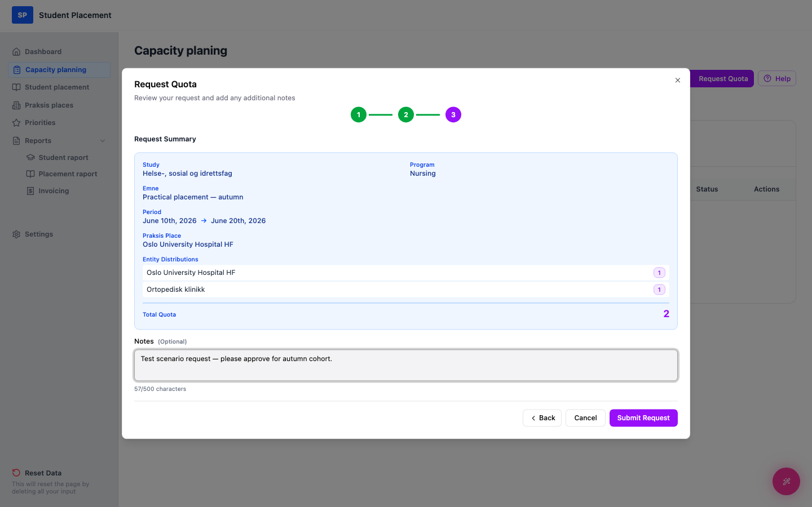

# Test Scenario 06 — Quota Request - Create

!!! info "Scenario overview"

    - **Page:** Capacity planning
    - **Role:** Placement Coordinator (PK)
    - **Goal:** From an empty starting state, create a new quota request and confirm it appears in the request list.
    - **Precondition:** Signed in as a coordinator. No quota requests exist yet (empty environment).

## What this page is

**Capacity planning** is where the coordinator asks practice places (hospitals/clinics)
 for student capacity. The **Quota Requests** list tracks every request you make and its status
 (`Pending → Approved/Rejected → Fulfilled`). You start a new request from the
 **Request Quota** button (top right).

---

## Steps

### 1. Start on the Dashboard

After signing in you land on the **Dashboard**. The **Quota Requests** widget shows
 *"No quota requests found"* — the environment is empty and ready for the scenario.

<figure markdown="span">
  
  <figcaption>Starting point — the Dashboard</figcaption>
</figure>

### 2. Open Capacity planning from the sidebar

In the left sidebar, click **Capacity planning**. The page opens with an empty list:
 *"No quota requests yet — Click 'Request Quota' to create your first request."*

<figure markdown="span">
  
  <figcaption>Capacity planning — empty starting state (after sidebar click)</figcaption>
</figure>

### 3. Step 1 of wizard — Request Details

Click **Request Quota** (top right) to open the 3-step wizard. Required fields are marked `*`.

1.  Select a **Praksis Place** (e.g. *Oslo University Hospital HF*).
2.  Pick a **Start Date** and **End Date** *(end must be after start)*.
3.  Select a **Study**, then a **Program** (program options depend on the study).
4.  Optionally type an **Emne** (course/subject name).
5.  Click **Next**.

<figure markdown="span">
  
  <figcaption>Wizard Step 1 — Request details</figcaption>
</figure>

### 4. Step 2 of wizard — Entity Distribution

6.  In the **Add Entities** tree, set a quota and click the blue **+** next to a department.
7.  Add at least one entity; added entities show on the right with a running **Total Requested Quota**.
8.  Click **Next**.

<figure markdown="span">
  
  <figcaption>Wizard Step 2 — Entity distribution</figcaption>
</figure>

### 5. Step 3 of wizard — Summary & Notes

9.  Review the **Request Summary**.
10.  Optionally add **Notes** for the practice place contact.
11.  Click **Submit Request**.

<figure markdown="span">
  
  <figcaption>Wizard Step 3 — Summary & notes</figcaption>
</figure>

---

## Final result

A *"Quota request submitted successfully"* toast appears, and the new request shows in the
 **Quota Requests** list with status Pending. Its capacity is also
 reflected in the **Available Quotas** section at the top.

<figure markdown="span">
  
  <figcaption>Final page — the new request appears in the list</figcaption>
</figure>

---

