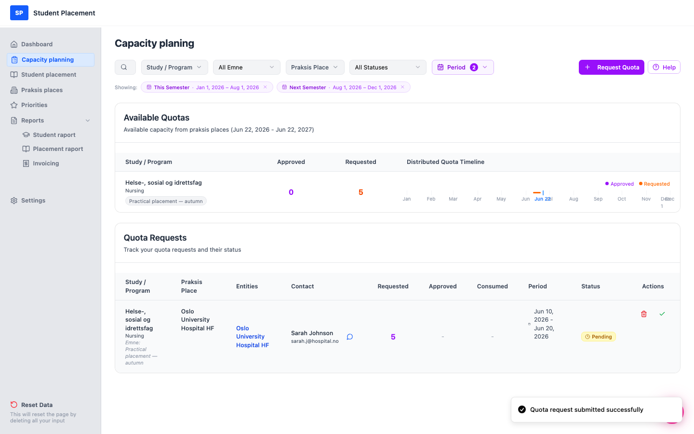
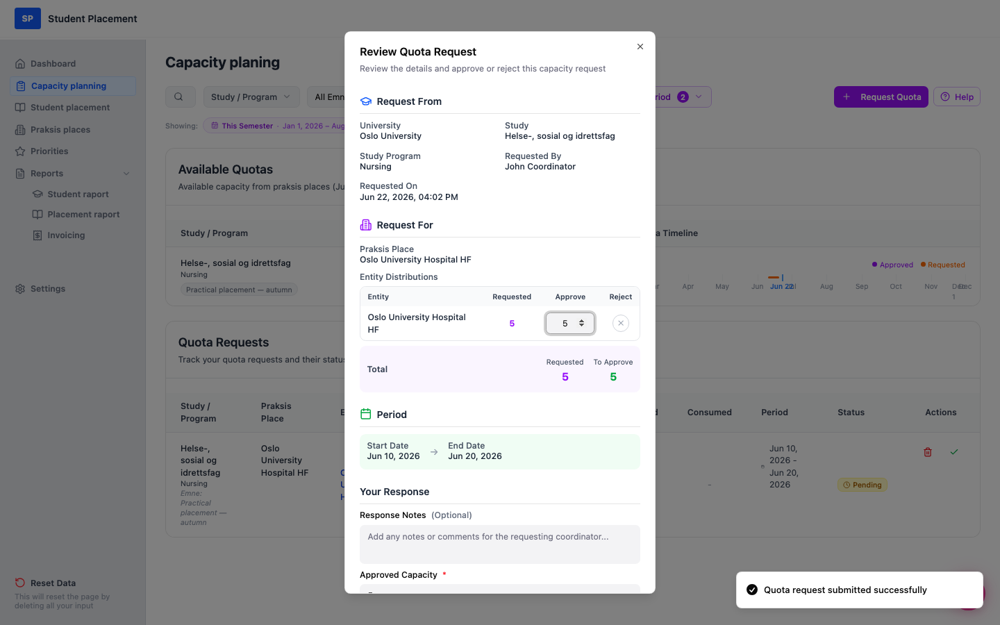

# Test Scenario 07 — Quota Request - Approve as PK

!!! info "Scenario overview"

    - **Page:** Capacity planning
    - **Role:** Placement Coordinator (PK), approving on behalf of the Student Coordinator (SK)
    - **Goal:** Approve a pending quota request using the green check action, and **change the approved quota** so it differs from what was requested.
    - **Precondition:** At least one Pending quota request exists. (Create one first with *Test Scenario 06*.) This scenario uses a request for **5** places.

## What this covers

A pending request normally gets approved by the Student Coordinator (SK) at the practice place. For testing,
 the coordinator (PK) can approve it directly from the **Quota Requests** list using the green
 ✓ action. During review you can **lower the approved quota per entity** — the
 approved amount can be less than (but not more than) the requested amount.

---

## Steps

### 1. Find the pending request and click the green check

On **Capacity planning**, locate the request with status Pending.
 In the **Actions** column, click the green ✓ (*"Approve on behalf of SK"*).

<figure markdown="span">
  
  <figcaption>The pending request — green ✓ in the Actions column (Requested = 5)</figcaption>
</figure>

### 2. Confirm the approval warning

A warning explains you're approving on behalf of the SK. Click **Continue to Review**.

<figure markdown="span">
  
  <figcaption>Warning — "Approve on Behalf of Student Coordinator"</figcaption>
</figure>

### 3. Review the request

The **Review Quota Request** modal shows the request details and an entity table with the
 **Requested** amount and an editable **Approve** field per entity.

<figure markdown="span">
  
  <figcaption>Review modal — Requested 5, Approve pre-filled to 5</figcaption>
</figure>

### 4. Change the approved quota

In the **Approve** field, change the value — here from **5** down to **3**. The
 **To Approve** total updates to **3**. *(The approve value cannot exceed the requested amount.)*
 Then click **Approve Request**.

<figure markdown="span">
  
  <figcaption>Approved quota changed: Requested 5 → To Approve 3</figcaption>
</figure>

---

## Final result

A *"Quota request updated"* toast appears and the request status becomes
 Approved, showing **Requested 5 / Approved 3**. The
 **Available Quotas** section reflects the approved capacity (Approved = 3).

<figure markdown="span">
  
  <figcaption>Final page — request Approved with Requested 5 / Approved 3</figcaption>
</figure>

---

