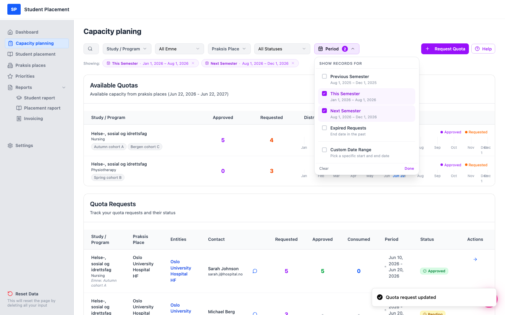
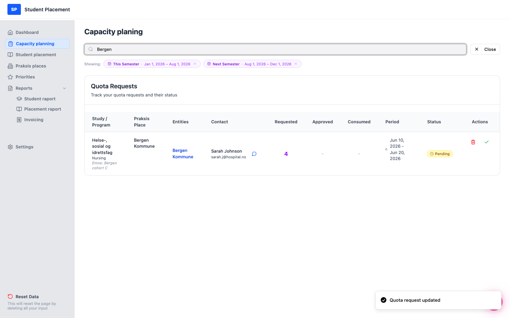
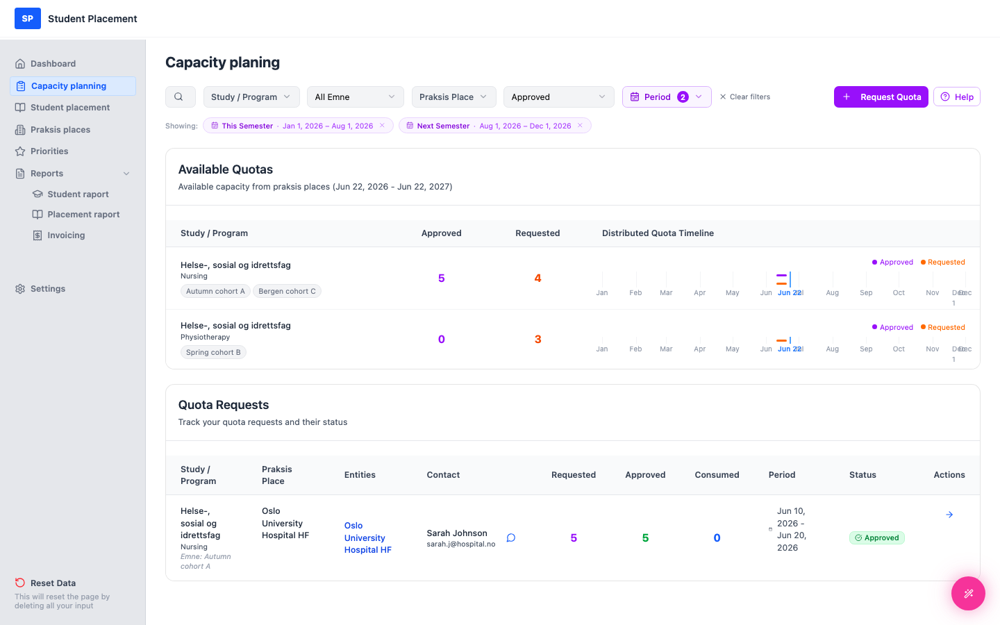

# Test Scenario 08 — Quota Request - Search & Filters

!!! info "Scenario overview"

    - **Page:** Capacity planning
    - **Role:** Placement Coordinator (PK)
    - **Goal:** Use the search box and the filter controls to narrow the Quota Requests list, then clear them.
    - **Precondition:** A few quota requests exist across different programs, places, and statuses. This scenario uses three:

| Request | Praksis Place | Program | Status |
|---|---|---|---|
| Autumn cohort A | Oslo University Hospital HF | Nursing | Approved |
| Spring cohort B | Oslo University Hospital HF | Physiotherapy | Pending |
| Bergen cohort C | Bergen Kommune | Nursing | Pending |

## The controls

-   **Period** — limit the list to one or more semesters, expired requests, or a custom date range. **Applied by default** (see below).
-   **Search** (magnifier icon) — free-text search across study, program, and praksis place name.
-   **Study / Program** — pick a study, then drill into a specific program.
-   **All Emne** — filter by course/subject code.
-   **Praksis Place** — pick a place, then optionally a specific entity.
-   **All Statuses** — Pending / Approved / Rejected / Fulfilled.
-   **Clear filters** — appears once any dropdown filter is active; resets them all (does not change the Period).
---

## Steps

### 1. Note the default period selection

The page does **not** start unfiltered. By default the **Period** filter is pre-set to
 **This Semester** + **Next Semester** — shown by the **2** badge on the Period button and the two
 chips under the toolbar (*"Showing: This Semester · … · Next Semester · …"*). Requests whose dates fall
 outside both semesters are hidden until you change this.

<figure markdown="span">
  
  <figcaption>Default state — Period = This Semester + Next Semester (badge "2", two chips)</figcaption>
</figure>

### 2. Open the Period filter

Click the **Period** button to open it. The two default semesters are checked. From here you can:

-   Toggle **Previous / This / Next Semester** or **Expired Requests** (multi-select).
-   Switch to **Custom Date Range** and pick a specific From/To.
-   Use **Clear** to remove all period limits (show every period), or **Done** to apply.

You can also remove a period directly by clicking the **×** on its chip under the toolbar.

<figure markdown="span">
  
  <figcaption>Period dropdown — This Semester & Next Semester checked by default</figcaption>
</figure>

### 3. Search by name

Click the **magnifier** icon to open the search box, then type a term — here `Bergen`.
 The list narrows to requests whose study, program, or praksis place matches. Click **Close** to exit search.

<figure markdown="span">
  
  <figcaption>Search "Bergen" → only the Bergen Kommune request</figcaption>
</figure>

### 4. Filter by status

Open the **Statuses** dropdown and choose **Approved**. Only approved requests remain.

<figure markdown="span">
  
  <figcaption>Status = Approved → only "Autumn cohort A"</figcaption>
</figure>

### 5. Filter by study / program

Open **Study / Program**, hover the study (*Helse-, sosial og idrettsfag*), then choose a
 program — here **Physiotherapy**. The list shows only that program's requests.

<figure markdown="span">
  
  <figcaption>Study / Program = Physiotherapy → only "Spring cohort B"</figcaption>
</figure>

### 6. Clear filters

Click **Clear filters** (or **×**) to reset the dropdown filters and return to the list
 (the Period selection stays as set).

<figure markdown="span">
  
  <figcaption>Filters cleared — list restored (default period still applied)</figcaption>
</figure>

---

