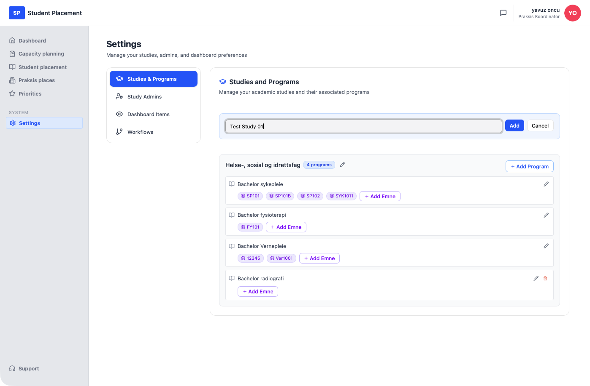
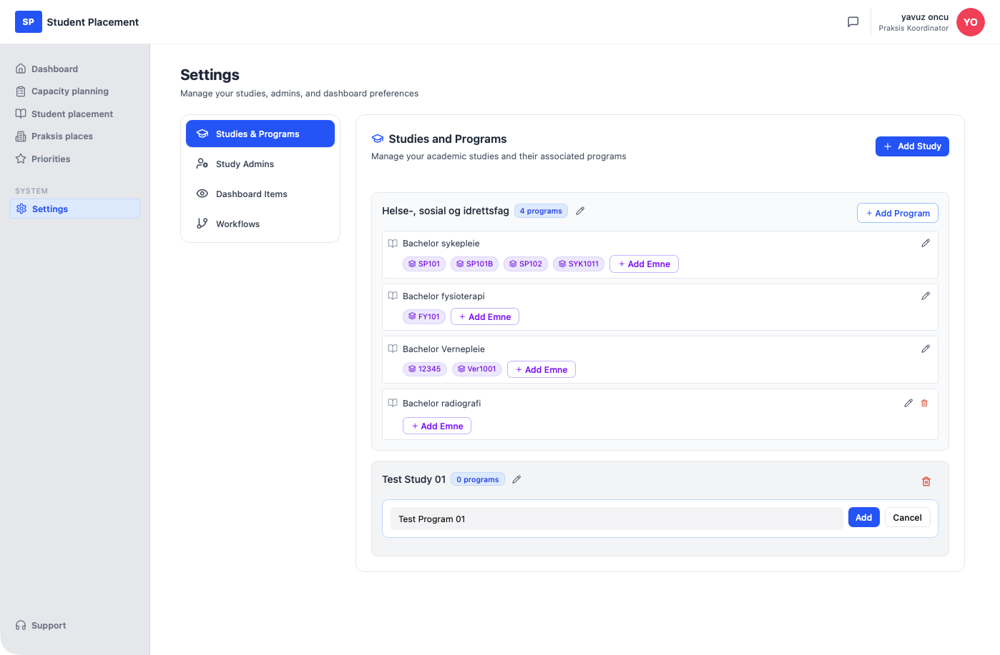
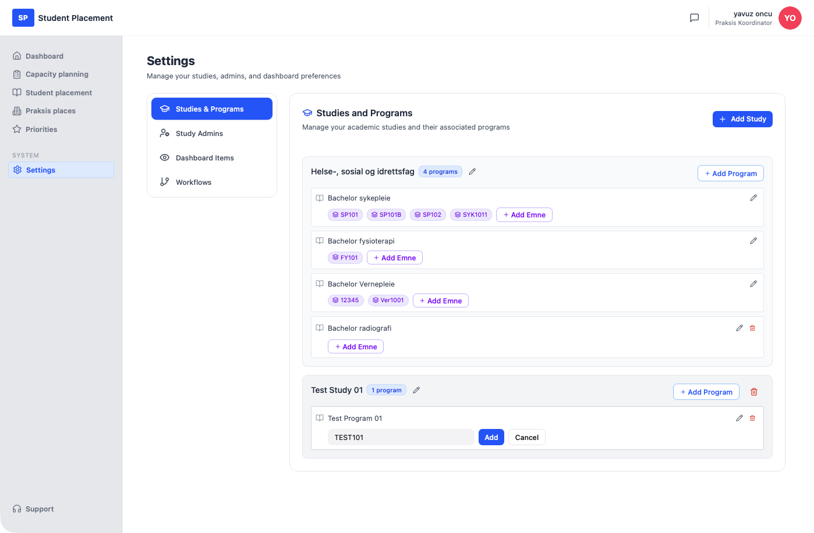
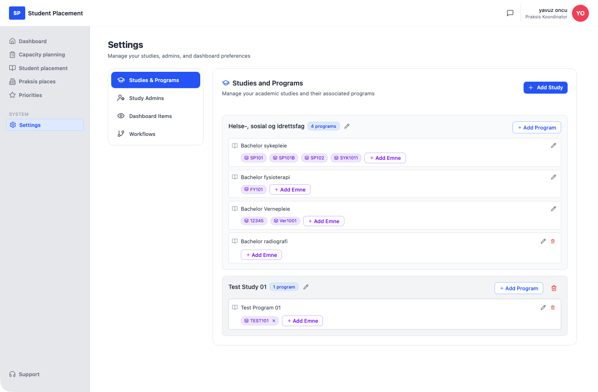

# Test Scenario 01 — Settings - Studies & Programs

!!! info "Scenario overview"

    - **Page:** Settings → Studies & Programs
    - **Role:** Placement Coordinator (PK)
    - **Goal:** Create a study, add a program to it, and attach an emne (cohort) to the program.
    - **Precondition:** Signed in as PK. The page may already contain studies — the flow works the same either way. On a fresh environment you will instead see *"No studies added yet — Click 'Add Study' to create your first study."*

## What this page is

**Studies & Programs** is the first tab on the Settings page (next to **Study Admins**, **Dashboard Items** and **Workflows**) and is where the academic structure is defined: a **Study** contains one or more **Programs**, and each program can optionally have one or more **Emner** (cohorts). Every study and program can later be renamed (pencil icon) or deleted (trash icon). This structure is what later drives study/program selection elsewhere in the app.

---

## Steps

### 1. Start on the Dashboard

After signing in you land on the **Dashboard**.

<figure markdown="span">
  
  <figcaption>Starting point — the Dashboard</figcaption>
</figure>

### 2. Open Settings → Studies & Programs

Click **Settings** in the sidebar. Settings opens on the **Studies & Programs** tab by default, listing any existing studies as cards with a program count badge.

<figure markdown="span">
  
  <figcaption>Studies & Programs — starting state with existing studies</figcaption>
</figure>

### 3. Create a study

Click **Add Study** (top right). An inline field with the placeholder *"Enter study name"* appears. Type the study name — here `Test Study 01` — and click **Add**. The new study card appears at the bottom of the list with a **0 programs** badge and the hint *"No programs added yet. Click 'Add Program' to add one."*

<figure markdown="span">
  
  <figcaption>Add Study — name entered in the inline field</figcaption>
</figure>

### 4. Add a program

On the new study card, click **Add Program**. An inline field with the placeholder *"Enter program name"* appears. Type the program name — here `Test Program 01` — and click **Add**.

<figure markdown="span">
  
  <figcaption>Add Program — name entered on the Test Study 01 card</figcaption>
</figure>

### 5. Program added

The study badge now reads **1 program**. The program row has its own edit (pencil) and delete (trash) icons and an **Add Emne** button.

<figure markdown="span">
  
  <figcaption>Test Program 01 added — badge shows 1 program</figcaption>
</figure>

### 6. Add an emne to the program

On the program row, click **Add Emne**. An inline field with the placeholder *"Emne / cohort name (e.g., Kull 2024 Høst)"* appears. Type the emne name — here `TEST101` — and click **Add**. The emne appears as a chip on the program, with an **×** to remove it again.

<figure markdown="span">
  
  <figcaption>Add Emne — name entered for Test Program 01</figcaption>
</figure>

---

## Final result

The study **Test Study 01** now has **1 program** — **Test Program 01** with the emne **TEST101** shown as a chip.

<figure markdown="span">
  
  <figcaption>Final state — study, program, and one emne</figcaption>
</figure>

## Deleting a study (optional)

Clicking the trash icon on a study card opens a confirmation dialog: *"Delete study? Study 'Test Study 01' and all programs in it will be deleted."* Click **Delete** to confirm or **Cancel** to keep the study.

<figure markdown="span">
  
  <figcaption>Delete study — confirmation dialog</figcaption>
</figure>

---

