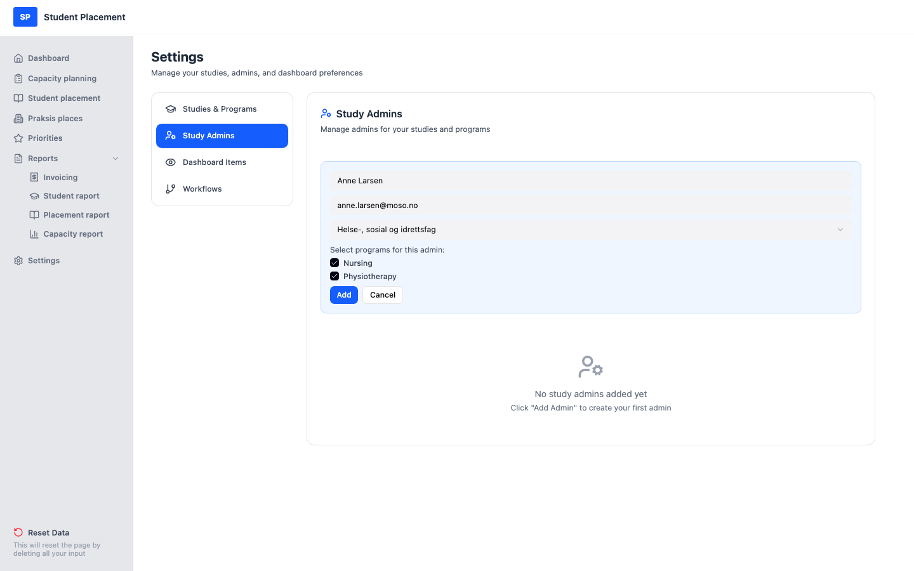
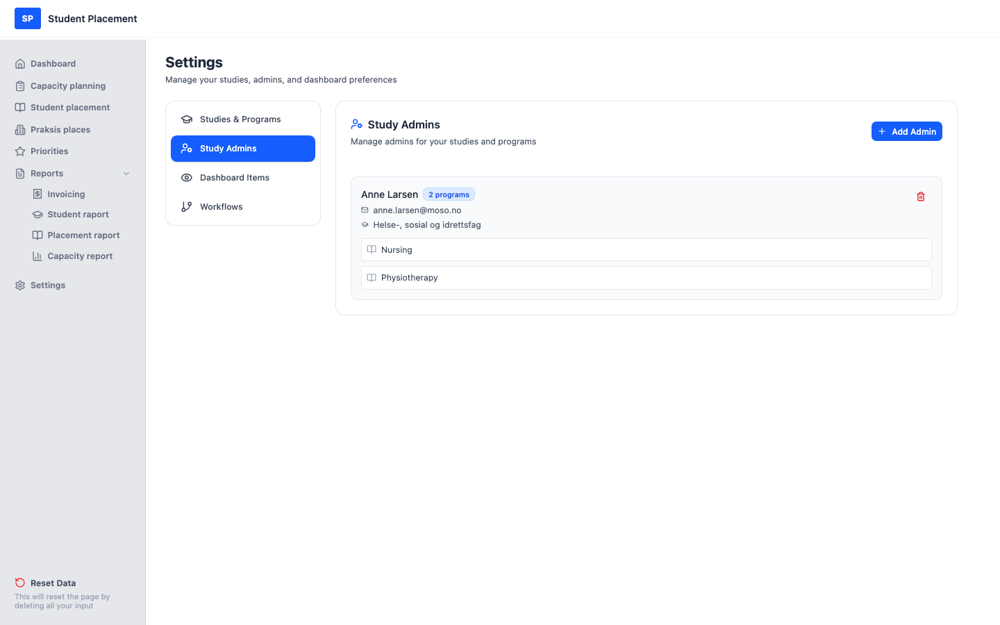

# Test Scenario 02 — Settings - Study Admins

!!! info "Scenario overview"

    - **Page:** Settings → Study Admins
    - **Role:** Placement Coordinator (PK)
    - **Goal:** From an empty state, create a study admin and assign them to a study and its programs.
    - **Precondition:** At least one study with programs exists (create one first with *Test Scenario 01*). No study admins are defined yet.

## What this page is

**Study Admins** (under Settings) is where you grant people administrative responsibility over a
 study and one or more of its programs. Each admin has a name, email, a single **study**, and a set of
 **programs** within that study.

---

## Steps

### 1. Start on the Dashboard

After signing in you land on the **Dashboard**.

<figure markdown="span">
  
  <figcaption>Starting point — the Dashboard</figcaption>
</figure>

### 2. Open Settings → Study Admins (empty)

Click **Settings** in the sidebar, then select **Study Admins**. The page is empty:
 *"No study admins added yet — Click 'Add Admin' to create your first admin."*

<figure markdown="span">
  
  <figcaption>Study Admins — empty starting state</figcaption>
</figure>

### 3. Add an admin

Click **Add Admin** (top right) and fill the form:

1.  Enter the admin's **name** — here `Anne Larsen`.
2.  Enter the admin's **email** — here `anne.larsen@moso.no`.
3.  Select a **study** from the dropdown (e.g. *Helse-, sosial og idrettsfag*).
4.  Tick the **programs** this admin manages — here **Nursing** and **Physiotherapy**.
5.  Click **Add**.

<figure markdown="span">
  
  <figcaption>Add Admin — name, email, study and programs selected</figcaption>
</figure>

---

## Final result

The new admin appears in the list with a **program count** badge, their email, the study, and the
 programs they manage.

<figure markdown="span">
  
  <figcaption>Final state — Anne Larsen created with 2 programs</figcaption>
</figure>

## Notes

-   **Study admin can see data only for selected studies**

---

