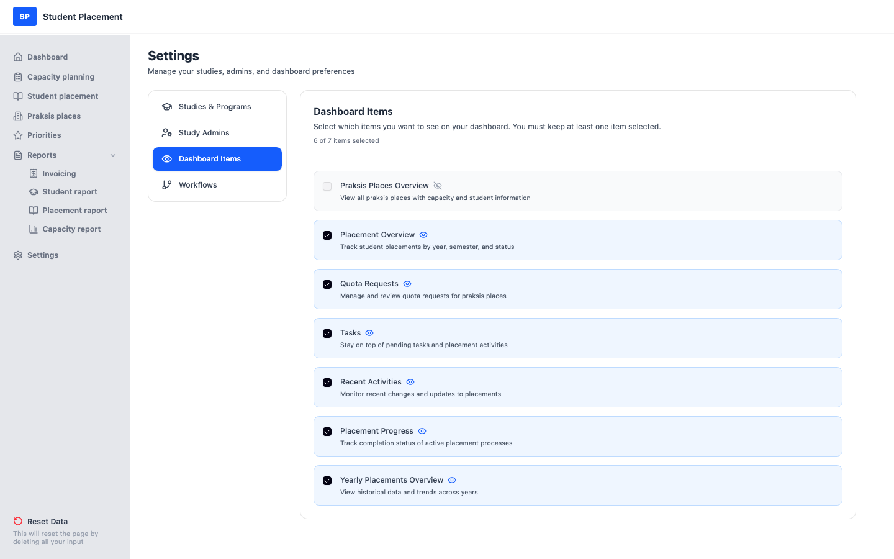

# Test Scenario 03 — Settings - Dashboard Items

!!! info "Scenario overview"

    - **Page:** Settings → Dashboard Items
    - **Role:** Placement Coordinator (PK)
    - **Goal:** Choose which widgets appear on the Dashboard, and confirm the Dashboard updates.

## What this page is

**Dashboard Items** (under Settings) controls which widgets are shown on your Dashboard
 (Placement Overview, Quota Requests, Tasks, Recent Activities, etc.). Toggling an item takes effect
 **immediately** — there is no separate save. At least one item must stay selected.

---

## Steps

### 1. Start on the Dashboard

Note the widgets currently shown — including the **Quota Requests** widget.

<figure markdown="span">
  
  <figcaption>Dashboard before — the Quota Requests widget is visible</figcaption>
</figure>

### 2. Open Settings → Dashboard Items

Click **Settings** in the sidebar, then **Dashboard Items**. Each widget is a card with a
 checkbox and an eye icon; the header shows how many of the items are selected.

<figure markdown="span">
  
  <figcaption>Dashboard Items — current selection</figcaption>
</figure>

### 3. Turn an item off

Click the **Quota Requests** checkbox to deselect it. The card turns grey, the icon changes to
 **hidden** (eye-off), and the count drops (e.g. *5 of 7 items selected*). The change saves instantly.

<figure markdown="span">
  
  <figcaption>Quota Requests deselected — now hidden</figcaption>
</figure>

### 4. Confirm on the Dashboard

Go back to the **Dashboard** — the **Quota Requests** widget is no longer shown.

<figure markdown="span">
  
  <figcaption>Dashboard after — the Quota Requests widget is gone</figcaption>
</figure>

---

## Validation — at least one item

You cannot hide every widget. With only one item left selected, attempting to deselect it is blocked
 and a red message appears: *"You must select at least one dashboard item to display."*

<figure markdown="span">
  
  <figcaption>Deselecting the last item is blocked</figcaption>
</figure>

---

