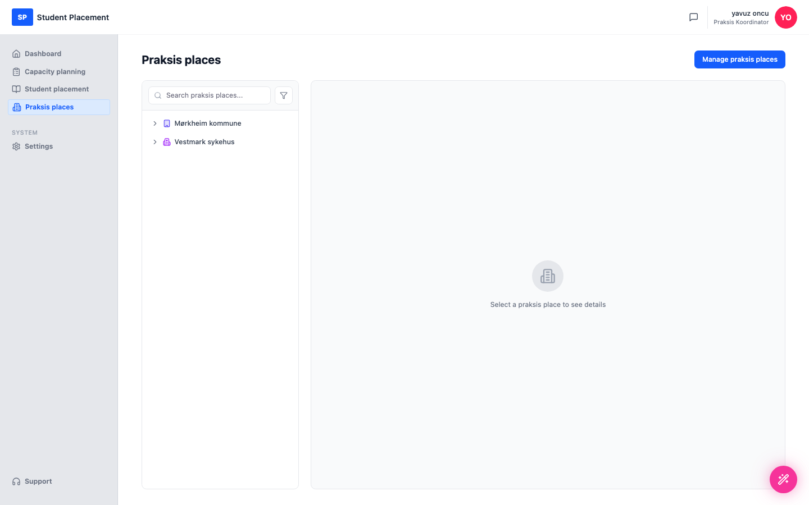

# Test Scenario 04 — Connect a Praksis Place to UH

!!! info "Scenario overview"

    - **Environment:** Live — sp.mosoinpraxis.com/praksis-places
    - **Role:** Praksis Koordinator
    - **Goal:** Connect an available praksis place to your organisation.
    - **Precondition:** Signed in (passwordless email login). Some praksis places in the catalogue are not yet connected to your organisation.

## What this page is

The **Praksis places** page lists the sites connected to your organisation. **Manage praksis places**
 opens the full catalogue, where you can **connect** (add) a place to your organisation or remove one.

---

## Steps

### 1. Open Praksis places

After signing in, click **Praksis places** in the sidebar.

<figure markdown="span">
  
  <figcaption>Praksis places — currently connected sites</figcaption>
</figure>

### 2. Open Manage praksis places

Click **Manage praksis places** (top right) to open the catalogue. Connected places show a
 Connected badge; ones you can add show a blue **+** in the Actions column.

<figure markdown="span">
  
  <figcaption>Manage praksis places — full catalogue with connect / remove actions</figcaption>
</figure>

### 3. Add a praksis place (first +)

Click the first **+** in the Actions column (here on **Oslo University Hospital HF**). A confirmation
 dialog appears: *"Oslo University Hospital HF will be added to your praksis places."*

<figure markdown="span">
  
  <figcaption>Connect dialog — confirm adding the place</figcaption>
</figure>

### 4. Click Connect

Click **Connect** in the dialog to confirm.

---

## Final result

The praksis place is added to your organisation — its row now shows the Connected
 badge and the **+** is replaced by a remove (trash) action.

<figure markdown="span">
  
  <figcaption>Final state — Oslo University Hospital HF is now Connected</figcaption>
</figure>

## Notes for testers

-   Use the **Filter by tag** chips (Connected / HF / Kommune) or **Search** to find a place.
-   To undo, use the **trash** icon on a connected row to disconnect it.
-   Sign-in is passwordless: request a code by email and enter the 6‑digit code.

---

