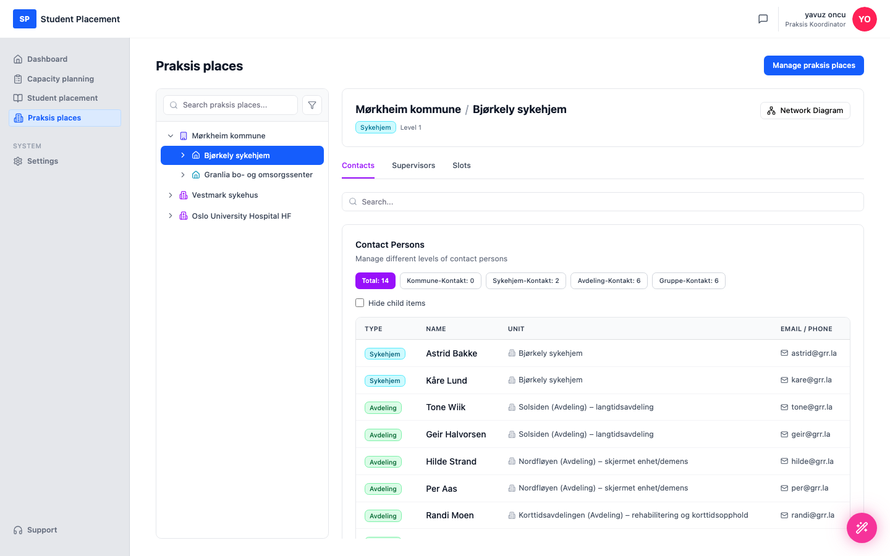
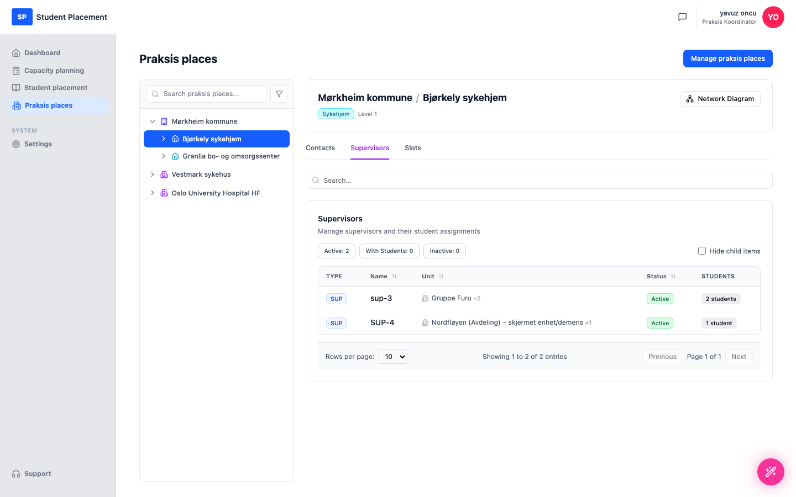
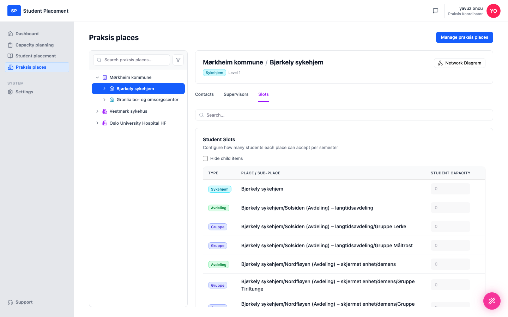

# Test Scenario 05 — Explore a Praksis Place

!!! info "Scenario overview"

    - **Environment:** Live — sp.mosoinpraxis.com/praksis-places
    - **Role:** Praksis Koordinator
    - **Goal:** Browse a praksis place's organisation tree and review an entity's contacts, supervisors and student slots.
    - **Precondition:** Signed in (passwordless email login). At least one praksis place is connected to your organisation.

## What this page is

The **Praksis places** page has a navigable **organisation tree** on the left (places → sub-places →
 departments → groups). Selecting an entity shows its details on the right across three tabs:
 **Contacts**, **Supervisors** and **Slots** (student capacity).

---

## Steps

### 1. Open Praksis places

Click **Praksis places** in the sidebar. The left column lists the connected places, each expandable.

<figure markdown="span">
  
  <figcaption>Praksis places — the organisation tree (left)</figcaption>
</figure>

### 2. Expand a praksis place

Click the chevron on the first place (**Mørkheim kommune**) to expand its entities — here
 **Bjørkely sykehjem** and **Granlia bo- og omsorgssenter**.

<figure markdown="span">
  
  <figcaption>Mørkheim kommune expanded — its sub-places appear</figcaption>
</figure>

### 3. Select an entity → Contacts

Click an entity in the tree — here **Bjørkely sykehjem**. The right panel opens on the
 **Contacts** tab.

<figure markdown="span">
  
  <figcaption>Contacts — contact persons by level (Kommune / Sykehjem / Avdeling / Gruppe), with totals</figcaption>
</figure>

**Contacts** lists the contact persons attached at each organisational level, with a per-level
 count (e.g. *Total 14*), unit, and email/phone. *Hide child items* limits it to the selected entity only.

### 4. Supervisors

Switch to the **Supervisors** tab to see the supervisors for the entity and their student
 assignments, with status (*Active / Inactive / With students*) counters.

<figure markdown="span">
  
  <figcaption>Supervisors — supervisors, their unit, status and assigned students</figcaption>
</figure>

### 5. Slots

Switch to the **Slots** tab to review the **student capacity** configured for the place and each
 of its sub-places per semester.

<figure markdown="span">
  
  <figcaption>Slots — student capacity per place / sub-place</figcaption>
</figure>

---

