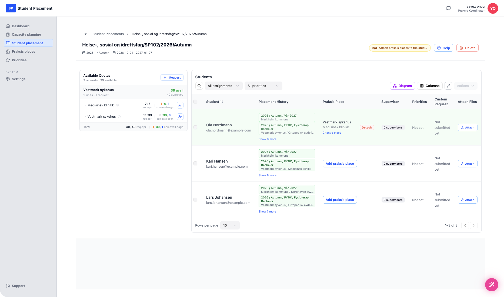
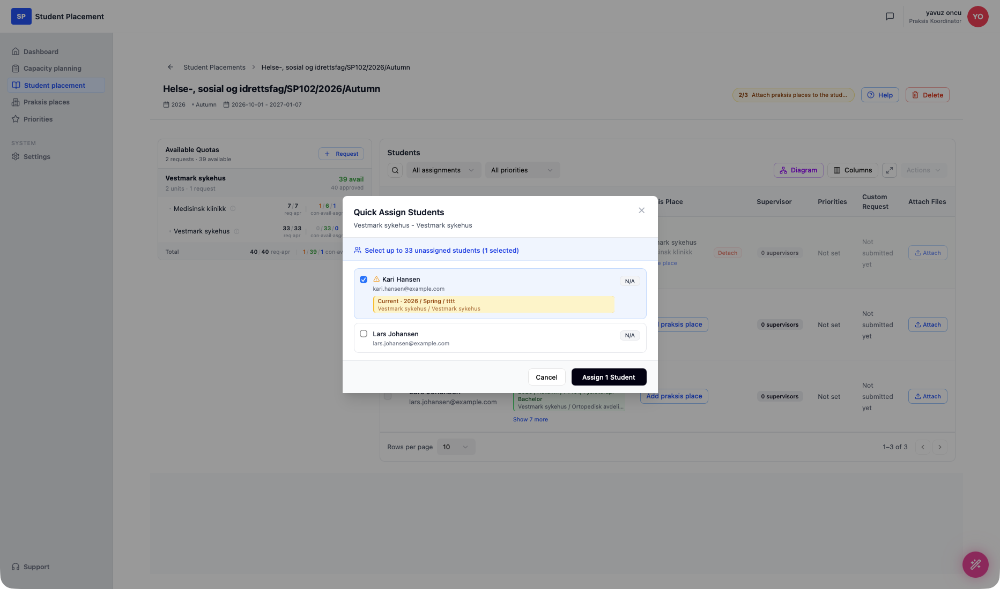
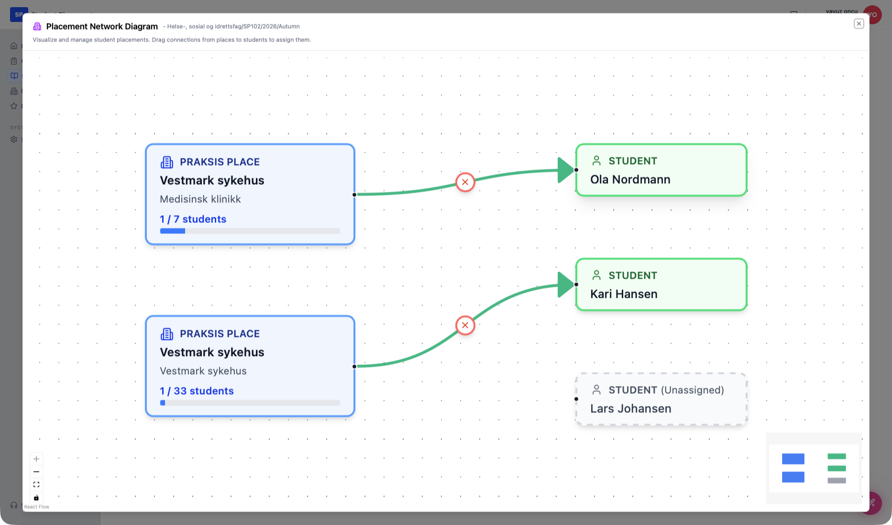
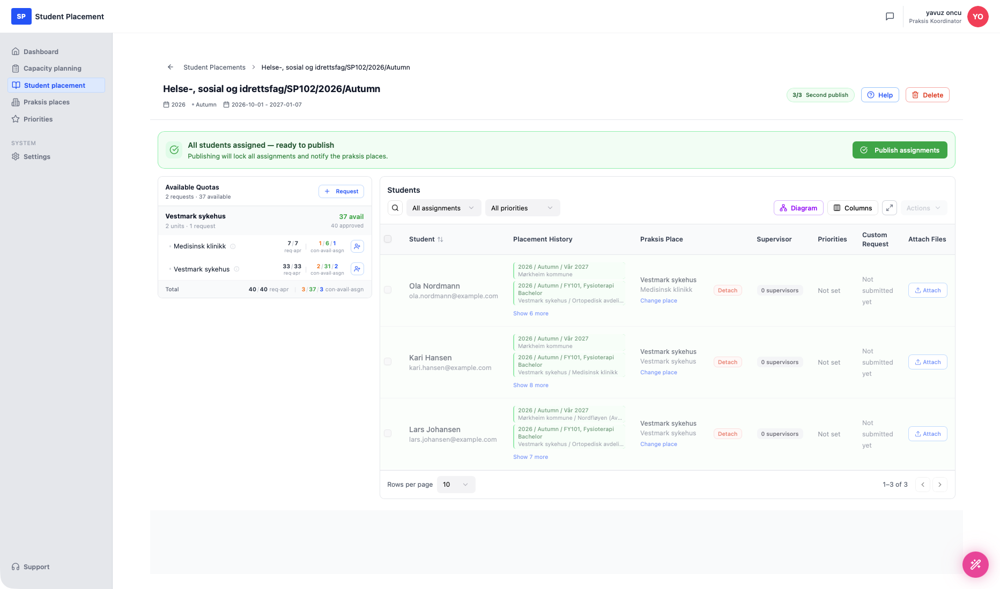

# Test Scenario 10 — Student Placement - Distributing students

!!! info "Scenario overview"

    - **Page:** Student placement → *(a placement)*
    - **Role:** Placement Coordinator (PK)
    - **Goal:** Distribute the imported students across the available quota (praksis places), so every student has a place for their internship.
    - **Precondition:** A placement exists with students imported and at least one approved quota. This walkthrough uses **Helse-, sosial og idrettsfag/SP102/2026/Autumn** with **3 imported students**.

## About importing students

Students are added to a placement before this step. They can be **imported from an Excel file** or **fetched automatically from the national student registry** — **FS** in Norway or **Ladok** in Sweden. For this demonstration, **3 mock students** were imported (Ola Nordmann, Kari Hansen, Lars Johansen).

## Understanding this page

The placement detail page has two linked panels:

- **Available Quotas** (left) — the **places students can be assigned to**. Each approved request is grouped by praksis place and broken down by unit, showing counts as **req · apr** (requested / approved) and **con · avail · asgn** (confirmed / available / assigned). The **+ (Assign students)** icon on a unit opens a quick-assign panel. The **Total** row sums the whole quota.
- **Students** (right) — the **people who must be placed** for their internship. Each row shows the student, their placement history, the assigned **Praksis Place** (or an **Add praksis place** button when none is set), supervisors, priorities, custom request and file attachments. Above the table are a search box, **All assignments** / **All priorities** filters, and the **Diagram**, **Columns**, expand and **Actions** buttons.

A progress badge at the top (e.g. **2/3 Attach praksis places to the students**) tracks how far the placement is through its workflow. As students get assigned, the quota counts on the left update in real time.

There are **three ways to assign a student to a place**, all shown below.

<figure markdown="span">
  
  <figcaption>The placement page — Available Quotas (left) and the 3 imported students (right)</figcaption>
</figure>

---

## Steps

### 1. Open the placement

Click **Student placement** in the sidebar and select **Helse-, sosial og idrettsfag/SP102/2026/Autumn**.

### 2. Assign the first student — "Add praksis place" (students table)

In the **Students** table, on **Ola Nordmann**'s row, click **Add praksis place**. A **Select Praksis Place** dialog lists the available quota requests (with availability and assigned counts). It also offers to *cancel* the student — with or without extra cost — so the placement can still be published if no place fits.

Choose a place — here **Vestmark sykehus · Medisinsk klinikk** — to assign Ola.

<figure markdown="span">
  
  <figcaption>"Add praksis place" — pick a quota request for the student</figcaption>
</figure>

The student's row now shows the assigned place with **Change place** / **Detach** options, and the Available Quotas counts update (the unit moves to *1 assigned*).

<figure markdown="span">
  
  <figcaption>Ola assigned to Medisinsk klinikk — quota counts updated on the left</figcaption>
</figure>

### 3. Assign the second student — Available Quotas "+" icon

In the **Available Quotas** panel, click the **+ (Assign students)** icon on a unit — here **Vestmark sykehus**. A **Quick Assign Students** panel opens listing the unassigned students. Tick **Kari Hansen** and click **Assign 1 Student**.

<figure markdown="span">
  
  <figcaption>Quick Assign — select unassigned students for a unit and assign in bulk</figcaption>
</figure>

### 4. Assign the last student — Diagram view

Click **Diagram** (above the students table) to open the **Placement Network Diagram**. It shows praksis places on the left and students on the right; existing assignments are drawn as connecting lines (each with a **×** to remove it), and unassigned students appear as dashed cards. You assign a student by **dragging a connection from a place to the student**.

Here **Lars Johansen** is the remaining unassigned student — connecting him to **Vestmark sykehus** completes the distribution.

<figure markdown="span">
  
  <figcaption>Diagram view — drag from a place to a student to assign (Lars still unassigned)</figcaption>
</figure>

---

## Final result

With all three students assigned, the progress badge reads **3/3** and a green banner appears: **"All students assigned — ready to publish. Publishing will lock all assignments and notify the praksis places."** A **Publish assignments** button becomes available. Every student row shows its assigned place, and the Available Quotas panel reflects **3 assigned**.

The scenario ends here — the students are fully distributed and the placement is ready to publish.

<figure markdown="span">
  
  <figcaption>All 3 students placed — ready to publish</figcaption>
</figure>

---

