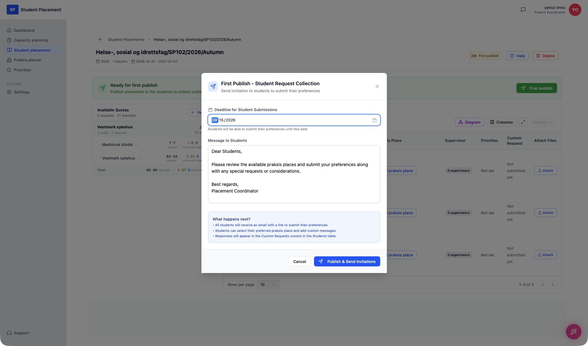

# Student Placement - Collecting student requests

!!! info "Scenario overview"

    - **Page:** Settings → Workflows, then Student placement → *(a placement)*
    - **Role:** Placement Coordinator (PK)
    - **Goal:** Enable the optional **First publish** workflow step, then publish a placement for the first time so students receive an email and can submit their own **custom requests** (preferred praksis place + a message).
    - **Precondition:** A placement with students already imported. This walkthrough uses **Helse-, sosial og idrettsfag/SP102/2026/Autumn**.

## What this optional workflow is

The placement process runs through a fixed set of workflow steps. Some are **Default** (always on) and some are **Optional** — you turn them on per your needs. **First publish** is an optional step that sits early in the process, *before* praksis places are attached to students.

When enabled and triggered, First publish sends every imported student an **email invitation** to log in and **submit their preferences**: which praksis place they'd like and any special request or consideration. Their responses come back into the **Custom Request** column of the Students table, so the coordinator can take them into account when assigning places. It's the mechanism for *collecting student requests* before distribution.

---

## Steps

### 1. Enable "First publish" in Settings → Workflows

Open **Settings** in the sidebar and select the **Workflows** tab. The **Placement workflow** table lists every step with its **Type** (Default / Optional) and **Status**. Default steps show a lock and *Always on*; optional steps have a toggle.

<figure markdown="span">
  
  <figcaption>Workflow Settings — "First publish" (step 2) is Optional and Off</figcaption>
</figure>

Toggle **First publish** on. A *"Workflow setting saved"* confirmation appears and the status switches to **On**. This adds the optional step to every placement's workflow.

<figure markdown="span">
  
  <figcaption>First publish is now On — the step is part of the placement workflow</figcaption>
</figure>

### 2. Open the placement

Create new placement and import students. Because First publish is now enabled, the placement's workflow gained a step (progress badge shows **2/4**), and a green banner appears: **"Ready for first publish — Publish placement to the students to collect custom requests"** with a **First publish** button.

Note the **Custom Request** column reads *"Not submitted yet"* for every student — nothing has been collected yet.

<figure markdown="span">
  
  <figcaption>The placement is ready for first publish</figcaption>
</figure>

### 3. First publish — configure the invitation

Click **First publish**. The **First Publish - Student Request Collection** dialog opens:

- **Deadline for Student Submissions** — the date until which students can submit their preferences.
- **Message to Students** — an editable email body (prefilled with a default message).
- **What happens next?** — a summary confirming that all students receive an email link, can pick a preferred praksis place and add a custom message, and that responses will appear in the **Custom Requests** column.

Set a deadline (here `09/15/2026`), adjust the message if needed, then click **Publish & Send Invitations**.

<figure markdown="span">
  
  <figcaption>First Publish — set the deadline and message, then send invitations</figcaption>
</figure>

---

## Final result

The placement is published to the students. The progress badge advances to **3/4 — Attach praksis places to the students**, and the "Ready for first publish" banner is gone. Every imported student now receives an email with a link to submit their preferences; until they respond, the **Custom Request** column stays *"Not submitted yet"*, and their answers appear there as they come in.

<figure markdown="span">
  
  <figcaption>After first publish — invitations sent, awaiting student submissions</figcaption>
</figure>

---

