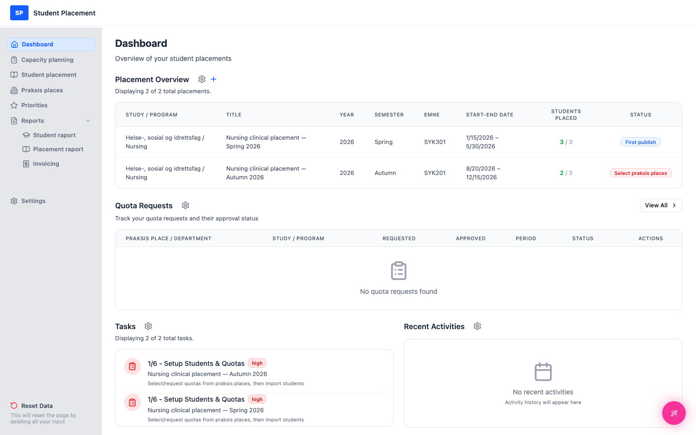

# Testscenario 06 — Kvoteforespørsel - Opprett

!!! info "Scenariooversikt"

    - **Side:** Capacity planning
    - **Rolle:** Praksiskoordinator (PK)
    - **Mål:** Opprett en ny kvoteforespørsel fra en tom starttilstand, og bekreft at den vises i forespørselslisten.
    - **Forutsetning:** Innlogget som koordinator. Ingen kvoteforespørsler finnes ennå (tomt miljø).

## Hva denne siden er

**Capacity planning** er der koordinatoren ber praksissteder (sykehus/klinikker)
 om studentkapasitet. Listen **Quota Requests** holder oversikt over hver forespørsel du sender og statusen dens
 (`Pending → Approved/Rejected → Fulfilled`). Du starter en ny forespørsel med knappen
 **Request Quota** (øverst til høyre).

---

## Trinn

### 1. Start på Dashboard

Etter innlogging kommer du til **Dashboard**. Widgeten **Quota Requests** viser
 *"No quota requests found"* — miljøet er tomt og klart for scenarioet.

<figure markdown="span">
  
  <figcaption>Startpunkt — Dashboard</figcaption>
</figure>

### 2. Åpne Capacity planning fra sidemenyen

Klikk på **Capacity planning** i sidemenyen til venstre. Siden åpnes med en tom liste:
 *"No quota requests yet — Click 'Request Quota' to create your first request."*

<figure markdown="span">
  
  <figcaption>Capacity planning — tom starttilstand (etter klikk i sidemenyen)</figcaption>
</figure>

### 3. Trinn 1 i veiviseren — Request Details

Klikk på **Request Quota** (øverst til høyre) for å åpne veiviseren med tre trinn. Obligatoriske felter er merket med `*`.

1.  Velg et **Praksis Place** (f.eks. *Oslo University Hospital HF*).
2.  Velg en **Start Date** og en **End Date** *(sluttdatoen må være etter startdatoen)*.
3.  Velg et **Study**, deretter et **Program** (programvalgene avhenger av studiet).
4.  Skriv eventuelt inn et **Emne** (emne-/fagnavn).
5.  Klikk på **Next**.

<figure markdown="span">
  
  <figcaption>Veiviseren trinn 1 — Forespørselsdetaljer</figcaption>
</figure>

### 4. Trinn 2 i veiviseren — Entity Distribution

6.  I treet **Add Entities** angir du en kvote og klikker på den blå **+** ved siden av en avdeling.
7.  Legg til minst én enhet; enheter som er lagt til, vises til høyre med en løpende **Total Requested Quota**.
8.  Klikk på **Next**.

<figure markdown="span">
  
  <figcaption>Veiviseren trinn 2 — Fordeling på enheter</figcaption>
</figure>

### 5. Trinn 3 i veiviseren — Summary & Notes

9.  Gå gjennom **Request Summary**.
10.  Legg eventuelt til **Notes** til kontaktpersonen ved praksisstedet.
11.  Klikk på **Submit Request**.

<figure markdown="span">
  
  <figcaption>Veiviseren trinn 3 — Oppsummering og notater</figcaption>
</figure>

---

## Sluttresultat

En *"Quota request submitted successfully"*-melding (toast) vises, og den nye forespørselen vises i
 listen **Quota Requests** med status Pending. Kapasiteten gjenspeiles også
 i seksjonen **Available Quotas** øverst.

<figure markdown="span">
  
  <figcaption>Siste side — den nye forespørselen vises i listen</figcaption>
</figure>

---

