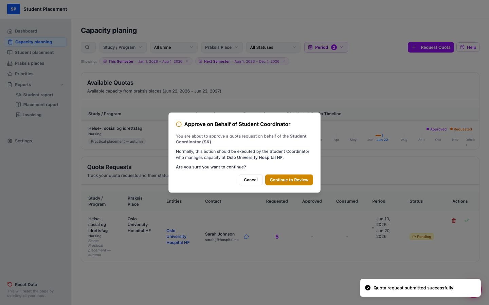
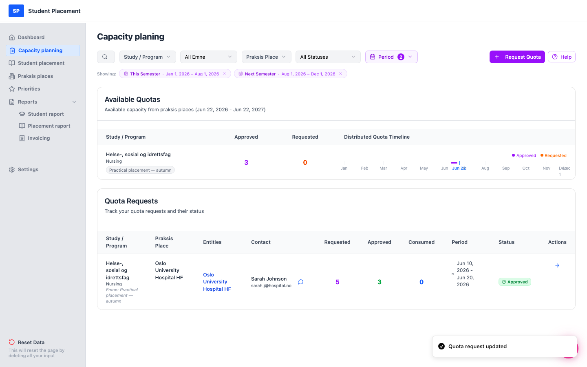

# Testscenario 07 — Kvoteforespørsel - Godkjenn som PK

!!! info "Scenariooversikt"

    - **Side:** Capacity planning
    - **Rolle:** Praksiskoordinator (PK), som godkjenner på vegne av studentkoordinatoren (SK)
    - **Mål:** Godkjenn en ventende kvoteforespørsel med den grønne hake-handlingen, og **endre den godkjente kvoten** slik at den avviker fra det som ble forespurt.
    - **Forutsetning:** Minst én kvoteforespørsel med status Pending finnes. (Opprett en først med *Testscenario 06*.) Dette scenarioet bruker en forespørsel om **5** plasser.

## Hva dette dekker

En ventende forespørsel godkjennes normalt av studentkoordinatoren (SK) ved praksisstedet. For testing
 kan koordinatoren (PK) godkjenne den direkte fra listen **Quota Requests** med den grønne
 ✓-handlingen. Under gjennomgangen kan du **senke den godkjente kvoten per enhet** — det
 godkjente antallet kan være mindre enn (men ikke større enn) det forespurte antallet.

---

## Trinn

### 1. Finn den ventende forespørselen og klikk på den grønne haken

På **Capacity planning** finner du forespørselen med status Pending.
 I kolonnen **Actions** klikker du på den grønne ✓ (*"Approve on behalf of SK"*).

<figure markdown="span">
  
  <figcaption>Den ventende forespørselen — grønn ✓ i Actions-kolonnen (Requested = 5)</figcaption>
</figure>

### 2. Bekreft godkjenningsadvarselen

En advarsel forklarer at du godkjenner på vegne av SK. Klikk på **Continue to Review**.

<figure markdown="span">
  
  <figcaption>Advarsel — "Approve on Behalf of Student Coordinator"</figcaption>
</figure>

### 3. Gå gjennom forespørselen

Modalvinduet **Review Quota Request** viser forespørselsdetaljene og en enhetstabell med
 **Requested**-antallet og et redigerbart **Approve**-felt per enhet.

<figure markdown="span">
  
  <figcaption>Gjennomgangsmodal — Requested 5, Approve forhåndsutfylt med 5</figcaption>
</figure>

### 4. Endre den godkjente kvoten

I **Approve**-feltet endrer du verdien — her fra **5** ned til **3**. Totalen
 **To Approve** oppdateres til **3**. *(Godkjenningsverdien kan ikke overstige det forespurte antallet.)*
 Klikk deretter på **Approve Request**.

<figure markdown="span">
  
  <figcaption>Godkjent kvote endret: Requested 5 → To Approve 3</figcaption>
</figure>

---

## Sluttresultat

En *"Quota request updated"*-melding (toast) vises, og forespørselens status blir
 Approved, med **Requested 5 / Approved 3**. Seksjonen
 **Available Quotas** gjenspeiler den godkjente kapasiteten (Approved = 3).

<figure markdown="span">
  
  <figcaption>Siste side — forespørselen Approved med Requested 5 / Approved 3</figcaption>
</figure>

---

