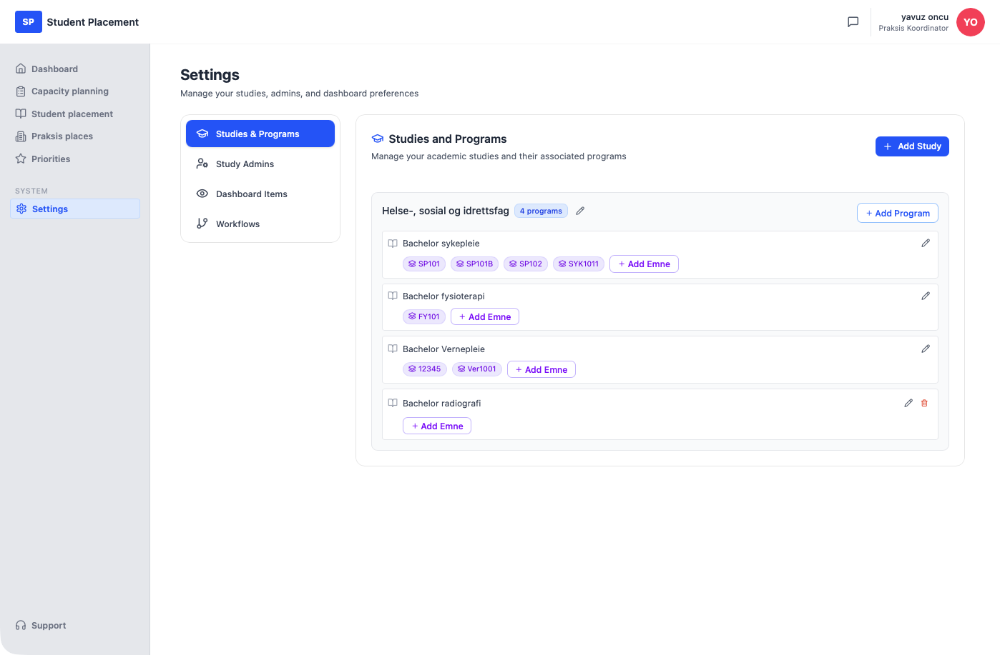
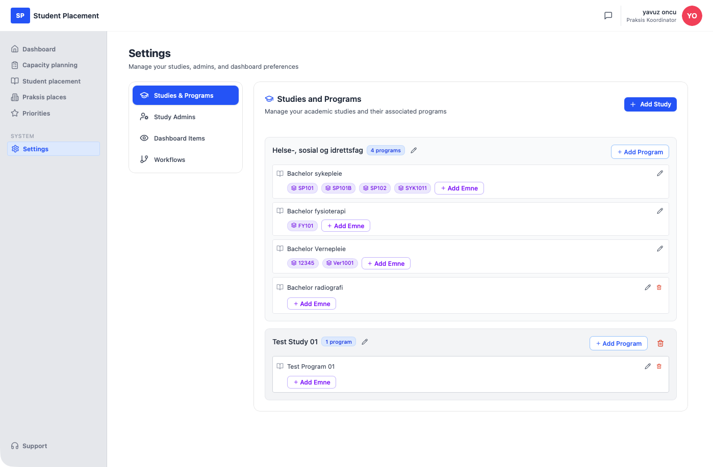

# Testscenario 01 — Innstillinger - Studier og programmer

!!! info "Scenariooversikt"

    - **Side:** Settings → Studies & Programs
    - **Rolle:** Praksiskoordinator (PK)
    - **Mål:** Opprett et studium, legg til et program i det, og knytt et emne (kull) til programmet.
    - **Forutsetning:** Innlogget som PK. Siden kan allerede inneholde studier — flyten er den samme uansett. I et helt tomt miljø vises i stedet *"No studies added yet — Click 'Add Study' to create your first study."*

## Hva denne siden er

**Studies & Programs** er den første fanen på Settings-siden (ved siden av **Study Admins**, **Dashboard Items** og **Workflows**) og er der den faglige strukturen defineres: et **Study** inneholder ett eller flere **Programs**, og hvert program kan eventuelt ha ett eller flere **Emner** (kull). Hvert studium og program kan senere gis nytt navn (blyantikon) eller slettes (søppelbøtteikon). Denne strukturen styrer senere valg av studium/program andre steder i applikasjonen.

---

## Trinn

### 1. Start på Dashboard

Etter innlogging kommer du til **Dashboard**.

<figure markdown="span">
  
  <figcaption>Startpunkt — Dashboard</figcaption>
</figure>

### 2. Åpne Settings → Studies & Programs

Klikk på **Settings** i sidemenyen. Settings åpnes som standard på fanen **Studies & Programs**, som viser eksisterende studier som kort med et merke for antall programmer.

<figure markdown="span">
  
  <figcaption>Studies & Programs — starttilstand med eksisterende studier</figcaption>
</figure>

### 3. Opprett et studium

Klikk på **Add Study** (øverst til høyre). Et innebygd felt med ledeteksten *"Enter study name"* vises. Skriv inn studienavnet — her `Test Study 01` — og klikk på **Add**. Det nye studiekortet vises nederst i listen med merket **0 programs** og hintet *"No programs added yet. Click 'Add Program' to add one."*

<figure markdown="span">
  
  <figcaption>Add Study — navn fylt inn i det innebygde feltet</figcaption>
</figure>

### 4. Legg til et program

På det nye studiekortet klikker du på **Add Program**. Et innebygd felt med ledeteksten *"Enter program name"* vises. Skriv inn programnavnet — her `Test Program 01` — og klikk på **Add**.

<figure markdown="span">
  
  <figcaption>Add Program — navn fylt inn på kortet Test Study 01</figcaption>
</figure>

### 5. Program lagt til

Studiemerket viser nå **1 program**. Programraden har egne ikoner for redigering (blyant) og sletting (søppelbøtte) samt en **Add Emne**-knapp.

<figure markdown="span">
  
  <figcaption>Test Program 01 lagt til — merket viser 1 program</figcaption>
</figure>

### 6. Legg til et emne i programmet

På programraden klikker du på **Add Emne**. Et innebygd felt med ledeteksten *"Emne / cohort name (e.g., Kull 2024 Høst)"* vises. Skriv inn emnenavnet — her `TEST101` — og klikk på **Add**. Emnet vises som en chip på programmet, med en **×** for å fjerne det igjen.

<figure markdown="span">
  
  <figcaption>Add Emne — navn fylt inn for Test Program 01</figcaption>
</figure>

---

## Sluttresultat

Studiet **Test Study 01** har nå **1 program** — **Test Program 01** med emnet **TEST101** vist som en chip.

<figure markdown="span">
  
  <figcaption>Sluttilstand — studium, program og ett emne</figcaption>
</figure>

## Slette et studium (valgfritt)

Klikk på søppelbøtteikonet på et studiekort for å åpne en bekreftelsesdialog: *"Delete study? Study 'Test Study 01' and all programs in it will be deleted."* Klikk på **Delete** for å bekrefte eller **Cancel** for å beholde studiet.

<figure markdown="span">
  
  <figcaption>Slette studium — bekreftelsesdialog</figcaption>
</figure>

---

