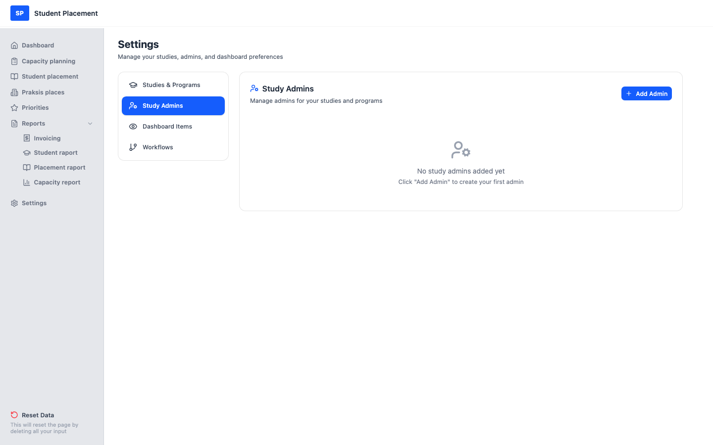

# Testscenario 02 — Innstillinger - Studieadministratorer

!!! info "Scenariooversikt"

    - **Side:** Settings → Study Admins
    - **Rolle:** Praksiskoordinator (PK)
    - **Mål:** Opprett en studieadministrator fra en tom tilstand, og tildel vedkommende et studium og programmene i det.
    - **Forutsetning:** Minst ett studium med programmer finnes (opprett ett først med *Testscenario 01*). Ingen studieadministratorer er definert ennå.

## Hva denne siden er

**Study Admins** (under Settings) er der du gir personer administrativt ansvar for et
 studium og ett eller flere av programmene i det. Hver administrator har et navn, en e-postadresse, ett enkelt **study** og et sett med
 **programs** innenfor dette studiet.

---

## Trinn

### 1. Start på Dashboard

Etter innlogging kommer du til **Dashboard**.

<figure markdown="span">
  
  <figcaption>Startpunkt — Dashboard</figcaption>
</figure>

### 2. Åpne Settings → Study Admins (tom)

Klikk på **Settings** i sidemenyen, og velg deretter **Study Admins**. Siden er tom:
 *"No study admins added yet — Click 'Add Admin' to create your first admin."*

<figure markdown="span">
  
  <figcaption>Study Admins — tom starttilstand</figcaption>
</figure>

### 3. Legg til en administrator

Klikk på **Add Admin** (øverst til høyre) og fyll ut skjemaet:

1.  Skriv inn administratorens **name** (navn) — her `Anne Larsen`.
2.  Skriv inn administratorens **email** (e-post) — her `anne.larsen@moso.no`.
3.  Velg et **study** fra nedtrekksmenyen (f.eks. *Helse-, sosial og idrettsfag*).
4.  Kryss av for de **programs** denne administratoren skal forvalte — her **Nursing** og **Physiotherapy**.
5.  Klikk på **Add**.

<figure markdown="span">
  
  <figcaption>Add Admin — navn, e-post, studium og programmer valgt</figcaption>
</figure>

---

## Sluttresultat

Den nye administratoren vises i listen med et merke for **antall programmer**, e-postadressen, studiet og
 programmene vedkommende forvalter.

<figure markdown="span">
  
  <figcaption>Sluttilstand — Anne Larsen opprettet med 2 programmer</figcaption>
</figure>

## Merknader

-   **Studieadministratorer kan bare se data for de valgte studiene**

---

