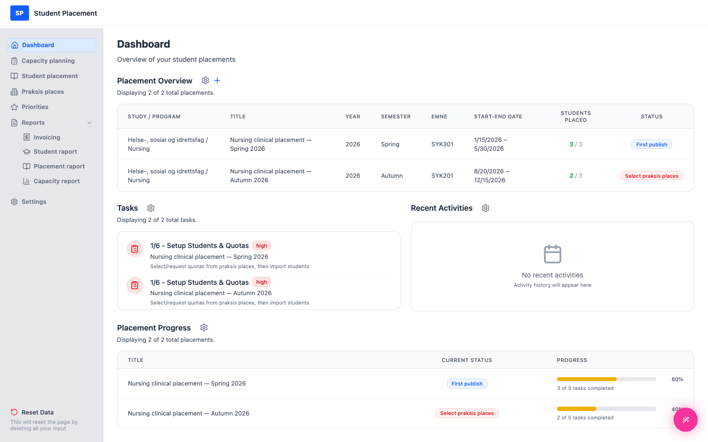

# Testscenario 03 — Innstillinger - Dashbordelementer

!!! info "Scenariooversikt"

    - **Side:** Settings → Dashboard Items
    - **Rolle:** Praksiskoordinator (PK)
    - **Mål:** Velg hvilke widgeter som skal vises på Dashboard, og bekreft at Dashboard oppdateres.

## Hva denne siden er

**Dashboard Items** (under Settings) styrer hvilke widgeter som vises på ditt Dashboard
 (Placement Overview, Quota Requests, Tasks, Recent Activities osv.). Å slå et element av eller på trer i kraft
 **umiddelbart** — det finnes ingen egen lagring. Minst ett element må forbli valgt.

---

## Trinn

### 1. Start på Dashboard

Merk deg widgetene som vises nå — inkludert widgeten **Quota Requests**.

<figure markdown="span">
  
  <figcaption>Dashboard før — Quota Requests-widgeten er synlig</figcaption>
</figure>

### 2. Åpne Settings → Dashboard Items

Klikk på **Settings** i sidemenyen, deretter på **Dashboard Items**. Hver widget er et kort med en
 avkrysningsboks og et øyeikon; overskriften viser hvor mange av elementene som er valgt.

<figure markdown="span">
  
  <figcaption>Dashboard Items — gjeldende valg</figcaption>
</figure>

### 3. Slå av et element

Klikk på avkrysningsboksen for **Quota Requests** for å velge den bort. Kortet blir grått, ikonet endres til
 **skjult** (overstrøket øye), og antallet synker (f.eks. *5 of 7 items selected*). Endringen lagres umiddelbart.

<figure markdown="span">
  
  <figcaption>Quota Requests valgt bort — nå skjult</figcaption>
</figure>

### 4. Bekreft på Dashboard

Gå tilbake til **Dashboard** — widgeten **Quota Requests** vises ikke lenger.

<figure markdown="span">
  
  <figcaption>Dashboard etter — Quota Requests-widgeten er borte</figcaption>
</figure>

---

## Validering — minst ett element

Du kan ikke skjule alle widgetene. Når bare ett element er valgt, blokkeres forsøk på å velge det bort,
 og en rød melding vises: *"You must select at least one dashboard item to display."*

<figure markdown="span">
  
  <figcaption>Å velge bort det siste elementet blokkeres</figcaption>
</figure>

---

