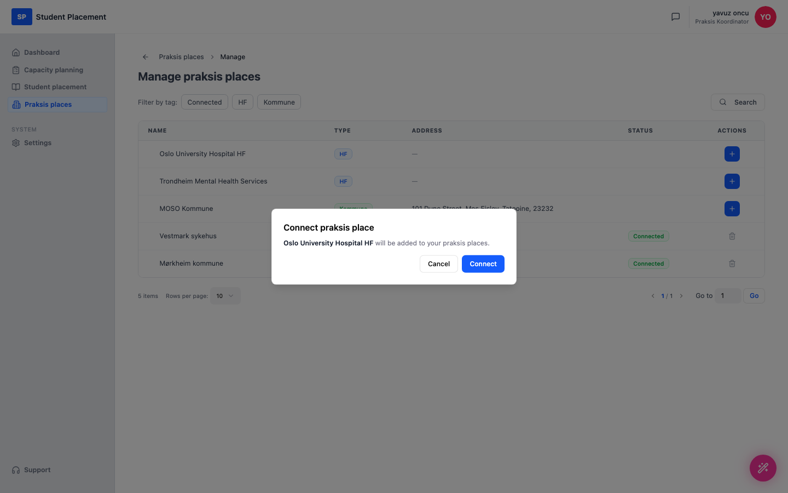

# Testscenario 04 — Koble et praksissted til UH

!!! info "Scenariooversikt"

    - **Miljø:** Live — sp.mosoinpraxis.com/praksis-places
    - **Rolle:** Praksiskoordinator
    - **Mål:** Koble et tilgjengelig praksissted til organisasjonen din.
    - **Forutsetning:** Innlogget (passordfri innlogging via e-post). Noen praksissteder i katalogen er ennå ikke koblet til organisasjonen din.

## Hva denne siden er

Siden **Praksis places** viser stedene som er koblet til organisasjonen din. **Manage praksis places**
 åpner hele katalogen, der du kan **koble til** (legge til) et sted i organisasjonen din eller fjerne et.

---

## Trinn

### 1. Åpne Praksis places

Etter innlogging klikker du på **Praksis places** i sidemenyen.

<figure markdown="span">
  
  <figcaption>Praksis places — steder som er koblet til nå</figcaption>
</figure>

### 2. Åpne Manage praksis places

Klikk på **Manage praksis places** (øverst til høyre) for å åpne katalogen. Tilkoblede steder viser et
 Connected-merke; steder du kan legge til, viser en blå **+** i Actions-kolonnen.

<figure markdown="span">
  
  <figcaption>Manage praksis places — hele katalogen med handlinger for å koble til / fjerne</figcaption>
</figure>

### 3. Legg til et praksissted (første +)

Klikk på den første **+** i Actions-kolonnen (her på **Oslo University Hospital HF**). En bekreftelsesdialog
 vises: *"Oslo University Hospital HF will be added to your praksis places."*

<figure markdown="span">
  
  <figcaption>Tilkoblingsdialog — bekreft at stedet legges til</figcaption>
</figure>

### 4. Klikk på Connect

Klikk på **Connect** i dialogen for å bekrefte.

---

## Sluttresultat

Praksisstedet er lagt til i organisasjonen din — raden viser nå Connected-merket,
 og **+** er erstattet av en fjern-handling (søppelbøtte).

<figure markdown="span">
  
  <figcaption>Sluttilstand — Oslo University Hospital HF er nå Connected</figcaption>
</figure>

## Merknader for testere

-   Bruk **Filter by tag**-chipene (Connected / HF / Kommune) eller **Search** for å finne et sted.
-   For å angre bruker du **trash**-ikonet (søppelbøtta) på en tilkoblet rad for å koble stedet fra.
-   Innloggingen er passordfri: be om en kode på e-post og skriv inn den 6-sifrede koden.

---

