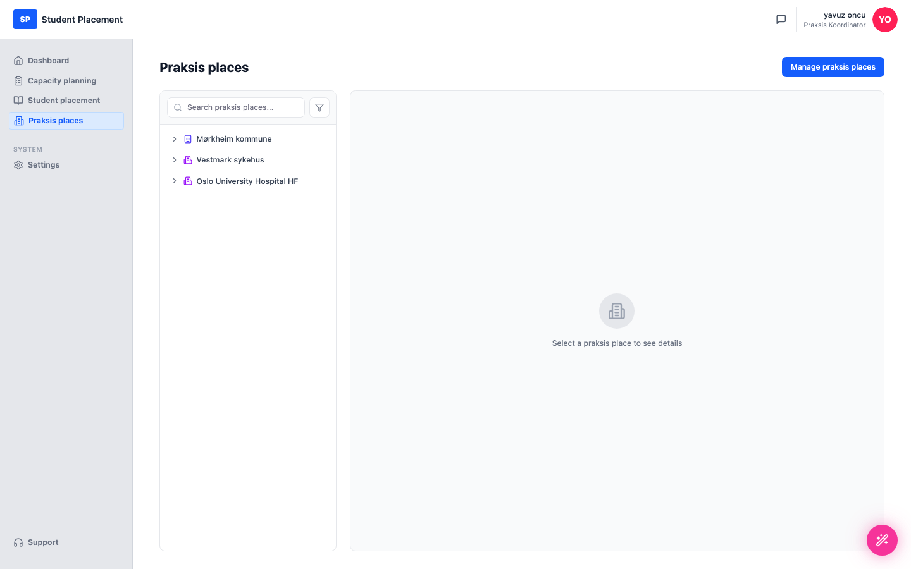
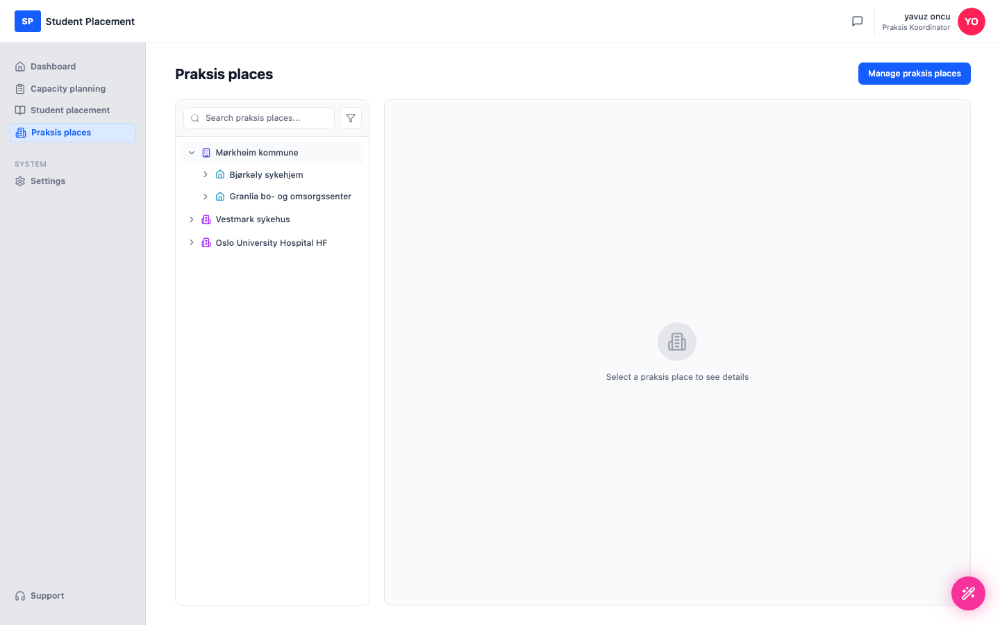

# Testscenario 05 — Utforsk et praksissted

!!! info "Scenariooversikt"

    - **Miljø:** Live — sp.mosoinpraxis.com/praksis-places
    - **Rolle:** Praksiskoordinator
    - **Mål:** Bla gjennom organisasjonstreet til et praksissted, og se på kontaktene, veilederne og studentplassene til en enhet.
    - **Forutsetning:** Innlogget (passordfri innlogging via e-post). Minst ett praksissted er koblet til organisasjonen din.

## Hva denne siden er

Siden **Praksis places** har et navigerbart **organisasjonstre** til venstre (steder → understeder →
 avdelinger → grupper). Når du velger en enhet, vises detaljene til høyre fordelt på tre faner:
 **Contacts**, **Supervisors** og **Slots** (studentkapasitet).

---

## Trinn

### 1. Åpne Praksis places

Klikk på **Praksis places** i sidemenyen. Kolonnen til venstre viser de tilkoblede stedene, som hver kan utvides.

<figure markdown="span">
  
  <figcaption>Praksis places — organisasjonstreet (til venstre)</figcaption>
</figure>

### 2. Utvid et praksissted

Klikk på pilen ved det første stedet (**Mørkheim kommune**) for å utvide enhetene — her
 **Bjørkely sykehjem** og **Granlia bo- og omsorgssenter**.

<figure markdown="span">
  
  <figcaption>Mørkheim kommune utvidet — understedene vises</figcaption>
</figure>

### 3. Velg en enhet → Contacts

Klikk på en enhet i treet — her **Bjørkely sykehjem**. Panelet til høyre åpnes på
 **Contacts**-fanen.

<figure markdown="span">
  
  <figcaption>Contacts — kontaktpersoner per nivå (Kommune / Sykehjem / Avdeling / Gruppe), med totaler</figcaption>
</figure>

**Contacts** viser kontaktpersonene som er knyttet til hvert organisasjonsnivå, med antall per
 nivå (f.eks. *Total 14*), enhet og e-post/telefon. *Hide child items* begrenser visningen til kun den valgte enheten.

### 4. Supervisors

Bytt til **Supervisors**-fanen for å se veilederne for enheten og studenttildelingene
 deres, med tellere for status (*Active / Inactive / With students*).

<figure markdown="span">
  
  <figcaption>Supervisors — veiledere, enheten deres, status og tildelte studenter</figcaption>
</figure>

### 5. Slots

Bytt til **Slots**-fanen for å se **studentkapasiteten** som er konfigurert for stedet og hvert
 av understedene per semester.

<figure markdown="span">
  
  <figcaption>Slots — studentkapasitet per sted / understed</figcaption>
</figure>

---

