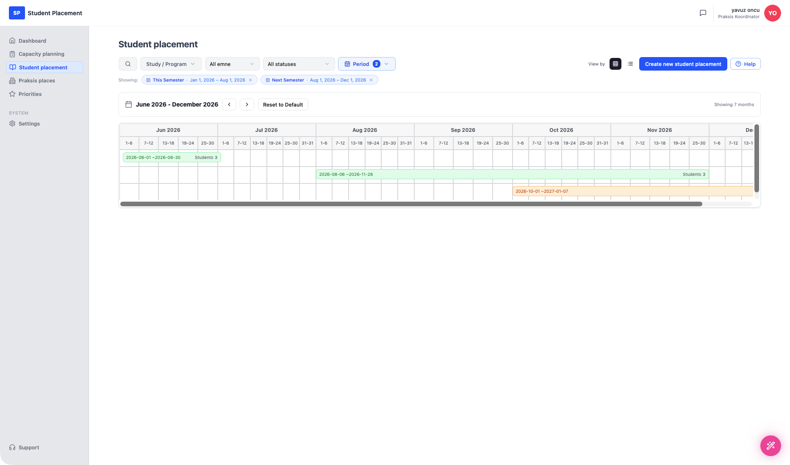

# Testscenario 09 — Studentplassering - Opprett

!!! info "Scenariooversikt"

    - **Side:** Student placement → New Student Placement
    - **Rolle:** Praksiskoordinator (PK)
    - **Mål:** Opprett en studentplassering fra en **godkjent kvoteforespørsel**, slik at plasseringen er koblet til forespørselen fra starten av.
    - **Forutsetning:** Minst én godkjent kvoteforespørsel med ledig kapasitet finnes (opprettet via Capacity planning). Plasseringsskjemaet fylles ikke lenger ut manuelt — detaljene kommer fra forespørselen du velger.

## Hva denne siden er

**Student placement** viser alle plasseringer for programmene dine. Øverst finnes filtre (**Study / Program**, **emne**, **status** og en **Period**-velger — de aktive periodene vises som fjernbare chips, f.eks. *This Semester · Jan 1, 2026 – Aug 1, 2026*). **View by**-bryteren veksler mellom to visninger:

- **Tabellvisning** — én rad per plassering med Study/Program, Title, Year, Semester, Emne, antall Students, Start–End date, Status og Pending steps, pluss paginering.
- **Kalendervisning** — en tidslinje over måneder (f.eks. *June 2026 – December 2026*, "Showing 7 months") der hver plassering tegnes som en horisontal stolpe over start–sluttdatoene sine, merket med datointervall og antall studenter. Pilene flytter det synlige vinduet, og **Reset to Default** gjenoppretter det.

---

## Trinn

### 1. Start på Dashboard

<figure markdown="span">
  
  <figcaption>Startpunkt — Dashboard</figcaption>
</figure>

### 2. Åpne Student placement

Klikk på **Student placement** i sidemenyen. Listen åpnes i visningen du brukte sist — her **tabellvisningen**.

<figure markdown="span">
  
  <figcaption>Student placement — tabellvisning med filtre og periode-chips</figcaption>
</figure>

Bytter du **View by** til kalenderen, vises de samme plasseringene som stolper på en månedstidslinje:

<figure markdown="span">
  
  <figcaption>Student placement — kalendervisning (plasseringer tegnet over datointervallene sine)</figcaption>
</figure>

### 3. Klikk på "Create new student placement"

Siden **New Student Placement** åpnes med meldingen *"Welcome! Let's Get Started — Pick an approved request to start a placement matched to it — or start a blank placement to fill the details yourself."*

Den viser de godkjente kvoteforespørslene med kapasitet for programmet ditt (her *"5 requests with capacity for your programme"*), filtrerbare på **programme**, **emne** og **period**. Hvert kort viser praksisstedet, programme · emne · periode, et **Approved**-merke, en kapasitetslinje (plasser i bruk vs. ledige), fordelingen per enhet og en **Use this**-knapp. Du kan også velge **Start a blank placement** eller **Request quota** hvis ingenting passer.

<figure markdown="span">
  
  <figcaption>New Student Placement — velg en godkjent kvoteforespørsel</figcaption>
</figure>

### 4. Velg en kvoteforespørsel og klikk på "Use this"

Velg forespørselen du vil basere plasseringen på — her **Mørkheim kommune · Bachelor Vernepleie · Ver1001 · 9 Sep 2026 – 9 Dec 2026** (90 ledige plasser) — og klikk på **Use this**.

### 5. Bekreft plasseringsdetaljene og opprett

Trinnet **Confirm placement details** vises: *"These come from the quota request and are locked so the placement stays matched. Name it, confirm the dates, then create."*

- **Praksis place**, **Programme**, **Emne** og **Quota window** vises skrivebeskyttet.
- **Placement title** er forhåndsutfylt (her `Helse-, sosial og idrettsfag/Ver1001/2026/Autumn`) og kan redigeres.
- **Start date** og **End date** er forhåndsutfylt med kvotevinduet og må holde seg innenfor det (*"On or after 9 Sep 2026"* / *"On or before 9 Dec 2026"*).

Huk av for **"The start and end dates are correct for this placement"** — den bekrefter *9 Sep 2026 – 9 Dec 2026 (within the quota window)* — og klikk på **Create & open**.

<figure markdown="span">
  
  <figcaption>Confirm placement details — låste forespørselsdata, forhåndsutfylte datoer, bekreftelsesboks</figcaption>
</figure>

---

## Sluttresultat

Plasseringen opprettes og åpnes på detaljsiden sin: **Helse-, sosial og idrettsfag/Ver1001/2026/Autumn** (2026 · Autumn · 2026-09-09 – 2026-12-09) med status **1/3 Setup Students & Quotas**. Fordi den ble opprettet fra forespørselen, viser **Available Quotas**-panelet til venstre allerede den koblede forespørselen — **Mørkheim kommune** med enhetene sine (Mørkheim kommune 45/45, Bjørkely sykehjem 45/45, totalt 90 ledige). Høyre kolonne ber deg om å **Import Students**.

Scenarioet slutter her — import av studenter dekkes i neste scenario.

<figure markdown="span">
  
  <figcaption>Etter Create & open — koblede kvoter til venstre, Import Students-oppfordring til høyre</figcaption>
</figure>

---

