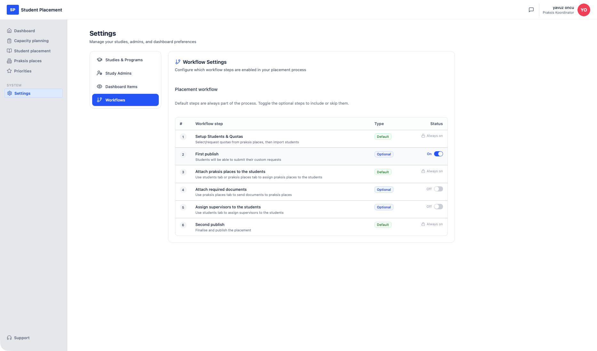
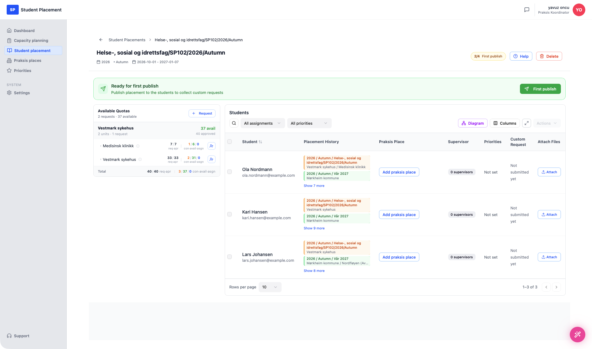
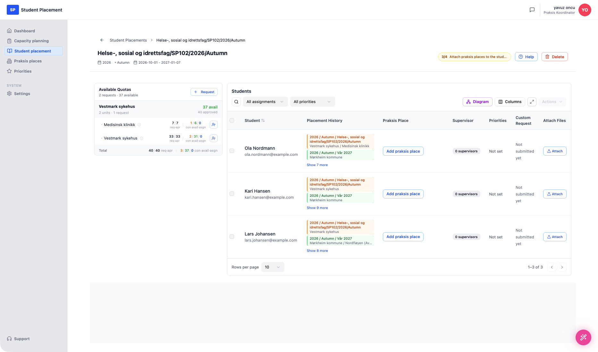

# Studentplassering - Samle inn studentønsker

!!! info "Scenariooversikt"

    - **Side:** Settings → Workflows, deretter Student placement → *(en plassering)*
    - **Rolle:** Praksiskoordinator (PK)
    - **Mål:** Aktiver det valgfrie arbeidsflyttrinnet **First publish**, og publiser deretter en plassering for første gang, slik at studentene får en e-post og kan sende inn sine egne **custom requests** (ønsket praksissted + en melding).
    - **Forutsetning:** En plassering med studenter allerede importert. Denne gjennomgangen bruker **Helse-, sosial og idrettsfag/SP102/2026/Autumn**.

## Hva denne valgfrie arbeidsflyten er

Plasseringsprosessen går gjennom et fast sett med arbeidsflyttrinn. Noen er **Default** (alltid på) og noen er **Optional** — du slår dem på etter behov. **First publish** er et valgfritt trinn som ligger tidlig i prosessen, *før* praksissteder knyttes til studenter.

Når det er aktivert og utløst, sender First publish hver importert student en **e-postinvitasjon** om å logge inn og **sende inn ønskene sine**: hvilket praksissted de ønsker, og eventuelle spesielle forespørsler eller hensyn. Svarene kommer tilbake i **Custom Request**-kolonnen i studenttabellen, slik at koordinatoren kan ta hensyn til dem ved tildeling av plasser. Det er mekanismen for å *samle inn studentønsker* før fordelingen.

---

## Trinn

### 1. Aktiver "First publish" i Settings → Workflows

Åpne **Settings** i sidemenyen og velg fanen **Workflows**. Tabellen **Placement workflow** viser hvert trinn med **Type** (Default / Optional) og **Status**. Standardtrinn viser en lås og *Always on*; valgfrie trinn har en bryter.

<figure markdown="span">
  
  <figcaption>Workflow Settings — "First publish" (trinn 2) er Optional og Off</figcaption>
</figure>

Slå på **First publish**. En bekreftelse *"Workflow setting saved"* vises, og statusen bytter til **On**. Dette legger det valgfrie trinnet til arbeidsflyten for alle plasseringer.

<figure markdown="span">
  
  <figcaption>First publish er nå On — trinnet er en del av plasseringsarbeidsflyten</figcaption>
</figure>

### 2. Åpne plasseringen

Opprett en ny plassering og importer studenter. Fordi First publish nå er aktivert, har plasseringens arbeidsflyt fått et trinn (fremdriftsmerket viser **2/4**), og et grønt banner vises: **"Ready for first publish — Publish placement to the students to collect custom requests"** med en **First publish**-knapp.

Merk at **Custom Request**-kolonnen viser *"Not submitted yet"* for hver student — ingenting er samlet inn ennå.

<figure markdown="span">
  
  <figcaption>Plasseringen er klar for first publish</figcaption>
</figure>

### 3. First publish — konfigurer invitasjonen

Klikk på **First publish**. Dialogen **First Publish - Student Request Collection** åpnes:

- **Deadline for Student Submissions** — datoen studentene kan sende inn ønskene sine frem til.
- **Message to Students** — en redigerbar e-posttekst (forhåndsutfylt med en standardmelding).
- **What happens next?** — et sammendrag som bekrefter at alle studentene får en e-postlenke, kan velge et ønsket praksissted og legge til en egen melding, og at svarene vises i **Custom Requests**-kolonnen.

Sett en frist (her `09/15/2026`), juster meldingen om nødvendig, og klikk deretter på **Publish & Send Invitations**.

<figure markdown="span">
  
  <figcaption>First Publish — sett fristen og meldingen, og send invitasjonene</figcaption>
</figure>

---

## Sluttresultat

Plasseringen er publisert til studentene. Fremdriftsmerket går videre til **3/4 — Attach praksis places to the students**, og "Ready for first publish"-banneret er borte. Hver importert student får nå en e-post med en lenke til å sende inn ønskene sine; inntil de svarer, forblir **Custom Request**-kolonnen *"Not submitted yet"*, og svarene deres vises der etter hvert som de kommer inn.

<figure markdown="span">
  
  <figcaption>Etter first publish — invitasjoner sendt, venter på studentinnsendinger</figcaption>
</figure>

---

