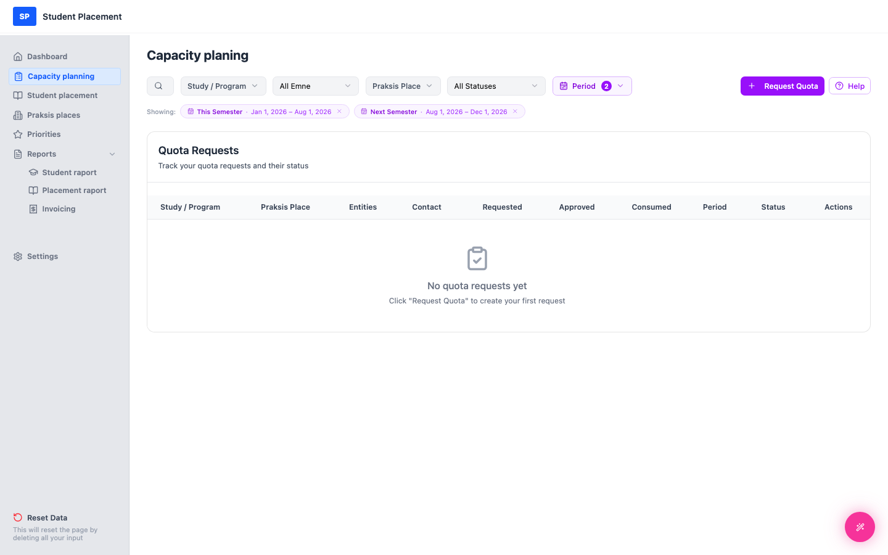
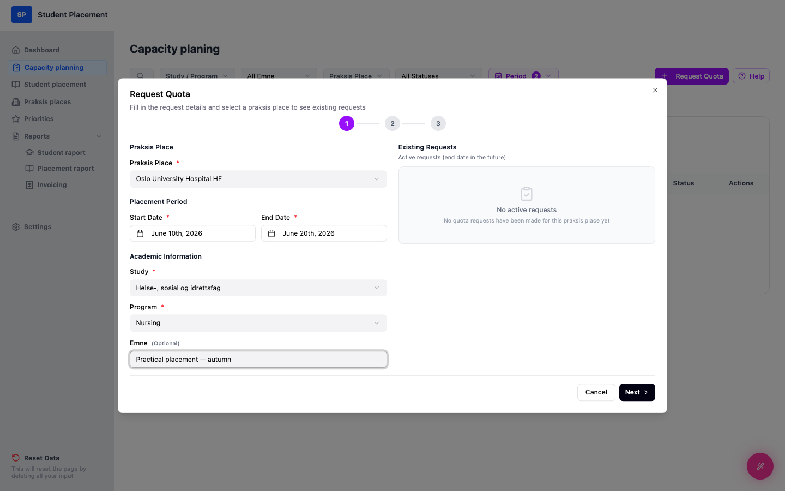
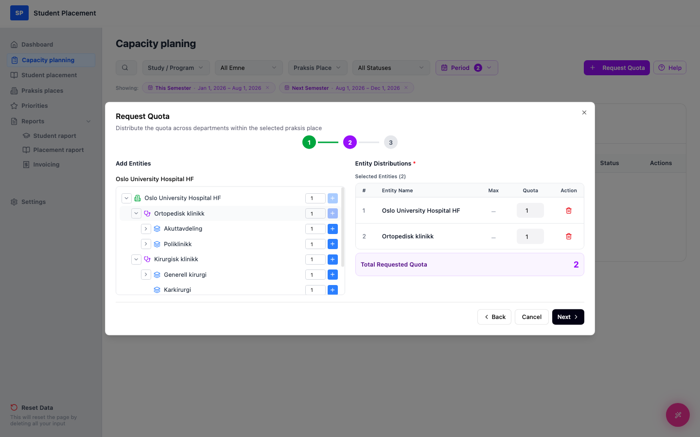
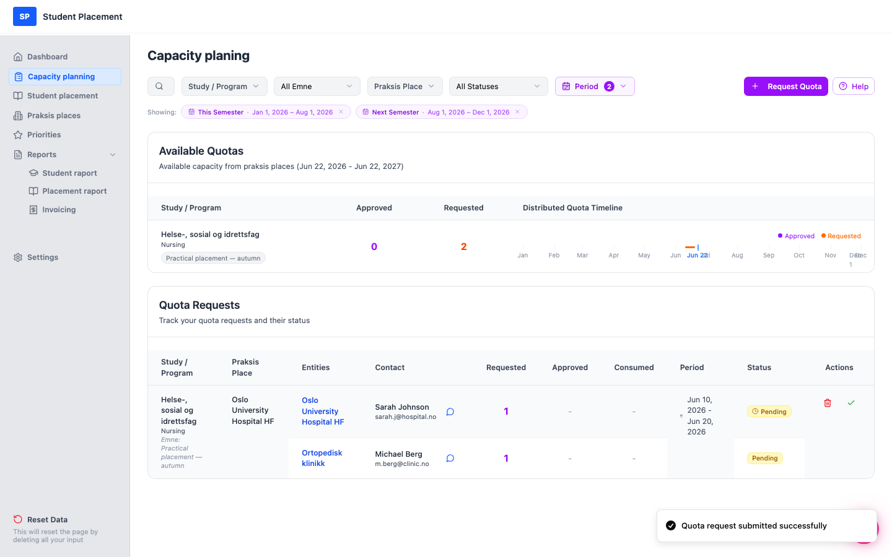

# Testscenario 06 — Kvotförfrågan - Skapa

!!! info "Scenarioöversikt"

    - **Sida:** Capacity planning
    - **Roll:** Placeringskoordinator (PK)
    - **Mål:** Skapa en ny kvotförfrågan från ett tomt utgångsläge och bekräfta att den visas i förfrågningslistan.
    - **Förutsättning:** Inloggad som koordinator. Inga kvotförfrågningar finns ännu (tom miljö).

## Vad den här sidan är

**Capacity planning** är där koordinatorn ber praktikplatser (sjukhus/kliniker)
 om studentkapacitet. Listan **Quota Requests** följer varje förfrågan du gör och dess status
 (`Pending → Approved/Rejected → Fulfilled`). Du startar en ny förfrågan via knappen
 **Request Quota** (uppe till höger).

---

## Steg

### 1. Börja på Dashboard

Efter inloggningen hamnar du på **Dashboard**. Widgeten **Quota Requests** visar
 *"No quota requests found"* — miljön är tom och redo för scenariot.

<figure markdown="span">
  
  <figcaption>Utgångspunkt — Dashboard</figcaption>
</figure>

### 2. Öppna Capacity planning från sidofältet

Klicka på **Capacity planning** i vänstra sidofältet. Sidan öppnas med en tom lista:
 *"No quota requests yet — Click 'Request Quota' to create your first request."*

<figure markdown="span">
  
  <figcaption>Capacity planning — tomt utgångsläge (efter klick i sidofältet)</figcaption>
</figure>

### 3. Steg 1 i guiden — Request Details

Klicka på **Request Quota** (uppe till höger) för att öppna guiden med tre steg. Obligatoriska fält är markerade med `*`.

1.  Välj en **Praksis Place** (t.ex. *Oslo University Hospital HF*).
2.  Välj ett **Start Date** och ett **End Date** *(slutdatumet måste vara efter startdatumet)*.
3.  Välj en **Study** och därefter ett **Program** (programalternativen beror på studien).
4.  Ange eventuellt ett **Emne** (kurs-/ämnesnamn).
5.  Klicka på **Next**.

<figure markdown="span">
  
  <figcaption>Guiden steg 1 — Förfrågningsdetaljer</figcaption>
</figure>

### 4. Steg 2 i guiden — Entity Distribution

6.  Ange en kvot i trädet **Add Entities** och klicka på det blå **+** bredvid en avdelning.
7.  Lägg till minst en enhet; tillagda enheter visas till höger med en löpande **Total Requested Quota**.
8.  Klicka på **Next**.

<figure markdown="span">
  
  <figcaption>Guiden steg 2 — Enhetsfördelning</figcaption>
</figure>

### 5. Steg 3 i guiden — Summary & Notes

9.  Granska **Request Summary**.
10.  Lägg eventuellt till **Notes** till kontaktpersonen på praktikplatsen.
11.  Klicka på **Submit Request**.

<figure markdown="span">
  
  <figcaption>Guiden steg 3 — Sammanfattning och anteckningar</figcaption>
</figure>

---

## Slutresultat

En toast med *"Quota request submitted successfully"* visas, och den nya förfrågan syns i
 listan **Quota Requests** med status Pending. Dess kapacitet återspeglas också
 i sektionen **Available Quotas** högst upp.

<figure markdown="span">
  
  <figcaption>Slutsida — den nya förfrågan visas i listan</figcaption>
</figure>

---

