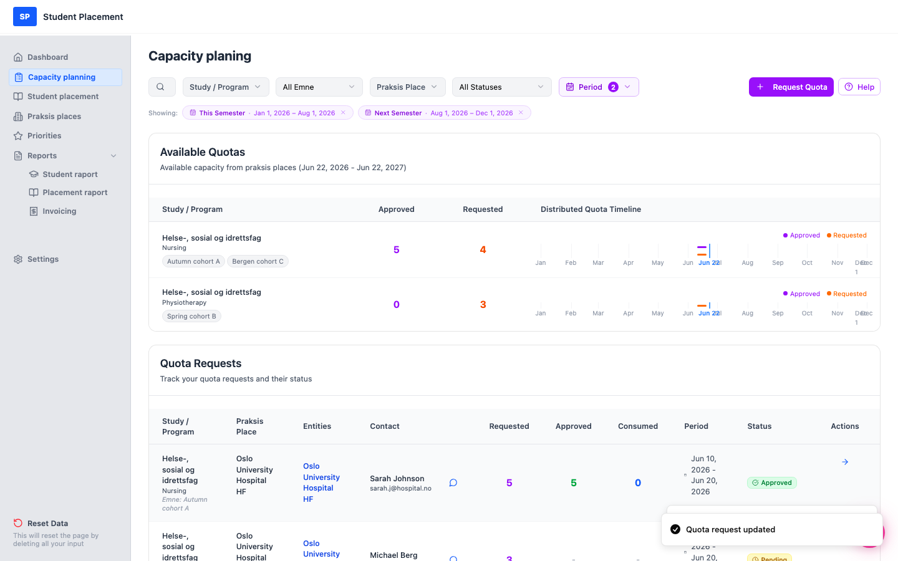
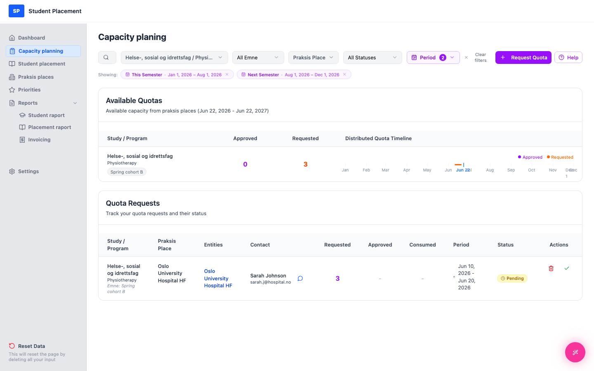
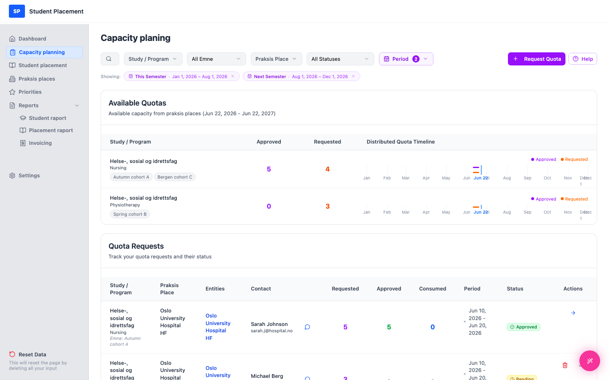

# Testscenario 08 — Kvotförfrågan - Sök och filter

!!! info "Scenarioöversikt"

    - **Sida:** Capacity planning
    - **Roll:** Placeringskoordinator (PK)
    - **Mål:** Använd sökrutan och filterkontrollerna för att avgränsa listan Quota Requests, och rensa dem sedan.
    - **Förutsättning:** Några kvotförfrågningar finns fördelade över olika program, platser och statusar. Det här scenariot använder tre:

| Förfrågan | Praksis Place | Program | Status |
|---|---|---|---|
| Autumn cohort A | Oslo University Hospital HF | Nursing | Approved |
| Spring cohort B | Oslo University Hospital HF | Physiotherapy | Pending |
| Bergen cohort C | Bergen Kommune | Nursing | Pending |

## Kontrollerna

-   **Period** — begränsa listan till en eller flera terminer, utgångna förfrågningar eller ett anpassat datumintervall. **Tillämpas som standard** (se nedan).
-   **Search** (förstoringsglasikonen) — fritextsökning i studie-, program- och praktikplatsnamn.
-   **Study / Program** — välj en studie och gå sedan vidare till ett specifikt program.
-   **All Emne** — filtrera på kurs-/ämneskod.
-   **Praksis Place** — välj en plats och eventuellt en specifik enhet.
-   **All Statuses** — Pending / Approved / Rejected / Fulfilled.
-   **Clear filters** — visas så snart något rullgardinsfilter är aktivt; återställer dem alla (ändrar inte Period).
---

## Steg

### 1. Notera standardvalet för period

Sidan startar **inte** ofiltrerad. Som standard är filtret **Period** förinställt på
 **This Semester** + **Next Semester** — vilket visas av siffran **2** på Period-knappen och de två
 chippen under verktygsfältet (*"Showing: This Semester · … · Next Semester · …"*). Förfrågningar vars datum
 ligger utanför båda terminerna döljs tills du ändrar detta.

<figure markdown="span">
  
  <figcaption>Standardläge — Period = This Semester + Next Semester (siffran "2", två chip)</figcaption>
</figure>

### 2. Öppna Period-filtret

Klicka på knappen **Period** för att öppna det. De två standardterminerna är förbockade. Härifrån kan du:

-   Växla **Previous / This / Next Semester** eller **Expired Requests** (flerval).
-   Byta till **Custom Date Range** och välja ett specifikt från/till-datum.
-   Använda **Clear** för att ta bort alla periodbegränsningar (visa alla perioder), eller **Done** för att tillämpa.

Du kan också ta bort en period direkt genom att klicka på **×** på dess chip under verktygsfältet.

<figure markdown="span">
  
  <figcaption>Period-rullgardinsmenyn — This Semester och Next Semester förbockade som standard</figcaption>
</figure>

### 3. Sök på namn

Klicka på **förstoringsglasikonen** för att öppna sökrutan och skriv sedan ett sökord — här `Bergen`.
 Listan avgränsas till förfrågningar vars studie, program eller praktikplats matchar. Klicka på **Close** för att avsluta sökningen.

<figure markdown="span">
  
  <figcaption>Sökning "Bergen" → endast förfrågan för Bergen Kommune</figcaption>
</figure>

### 4. Filtrera på status

Öppna rullgardinsmenyn **Statuses** och välj **Approved**. Endast godkända förfrågningar återstår.

<figure markdown="span">
  
  <figcaption>Status = Approved → endast "Autumn cohort A"</figcaption>
</figure>

### 5. Filtrera på studie/program

Öppna **Study / Program**, håll muspekaren över studien (*Helse-, sosial og idrettsfag*) och välj sedan ett
 program — här **Physiotherapy**. Listan visar endast det programmets förfrågningar.

<figure markdown="span">
  
  <figcaption>Study / Program = Physiotherapy → endast "Spring cohort B"</figcaption>
</figure>

### 6. Rensa filter

Klicka på **Clear filters** (eller **×**) för att återställa rullgardinsfiltren och återgå till listan
 (periodvalet ligger kvar som det är inställt).

<figure markdown="span">
  
  <figcaption>Filter rensade — listan återställd (standardperioden tillämpas fortfarande)</figcaption>
</figure>

---

