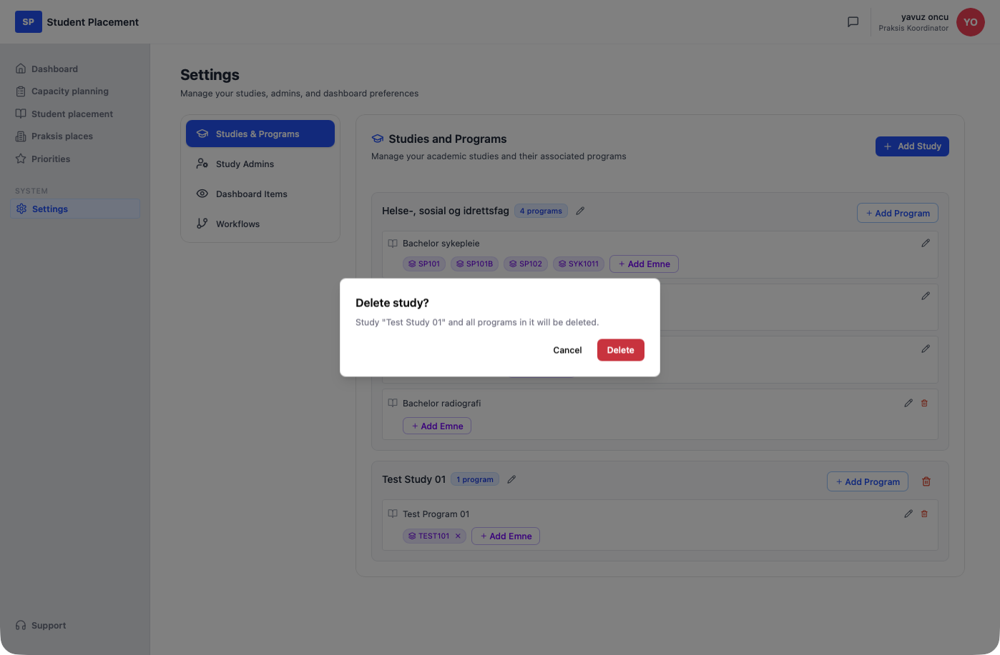

# Testscenario 01 — Inställningar - Studier och program

!!! info "Scenarioöversikt"

    - **Sida:** Settings → Studies & Programs
    - **Roll:** Placeringskoordinator (PK)
    - **Mål:** Skapa en studie, lägg till ett program i den och koppla ett emne (kull) till programmet.
    - **Förutsättning:** Inloggad som PK. Sidan kan redan innehålla studier — flödet är detsamma oavsett. I en helt tom miljö visas i stället *"No studies added yet — Click 'Add Study' to create your first study."*

## Vad den här sidan är

**Studies & Programs** är den första fliken på Settings-sidan (bredvid **Study Admins**, **Dashboard Items** och **Workflows**) och är där den akademiska strukturen definieras: en **Study** innehåller ett eller flera **Programs**, och varje program kan valfritt ha ett eller flera **Emner** (kullar). Varje studie och program kan senare byta namn (pennikon) eller tas bort (papperskorgsikon). Den här strukturen styr senare valen av studie/program på andra ställen i appen.

---

## Steg

### 1. Börja på Dashboard

Efter inloggningen hamnar du på **Dashboard**.

<figure markdown="span">
  
  <figcaption>Utgångspunkt — Dashboard</figcaption>
</figure>

### 2. Öppna Settings → Studies & Programs

Klicka på **Settings** i sidofältet. Settings öppnas som standard på fliken **Studies & Programs**, som visar befintliga studier som kort med en etikett för antal program.

<figure markdown="span">
  
  <figcaption>Studies & Programs — utgångsläge med befintliga studier</figcaption>
</figure>

### 3. Skapa en studie

Klicka på **Add Study** (uppe till höger). Ett inbyggt fält med platshållartexten *"Enter study name"* visas. Skriv studiens namn — här `Test Study 01` — och klicka på **Add**. Det nya studiekortet visas längst ner i listan med etiketten **0 programs** och tipset *"No programs added yet. Click 'Add Program' to add one."*

<figure markdown="span">
  
  <figcaption>Add Study — namn angivet i det inbyggda fältet</figcaption>
</figure>

### 4. Lägg till ett program

Klicka på **Add Program** på det nya studiekortet. Ett inbyggt fält med platshållartexten *"Enter program name"* visas. Skriv programmets namn — här `Test Program 01` — och klicka på **Add**.

<figure markdown="span">
  
  <figcaption>Add Program — namn angivet på kortet Test Study 01</figcaption>
</figure>

### 5. Program tillagt

Studiens etikett visar nu **1 program**. Programraden har egna ikoner för redigering (penna) och borttagning (papperskorg) samt en **Add Emne**-knapp.

<figure markdown="span">
  
  <figcaption>Test Program 01 tillagt — etiketten visar 1 program</figcaption>
</figure>

### 6. Lägg till ett emne till programmet

Klicka på **Add Emne** på programraden. Ett inbyggt fält med platshållartexten *"Emne / cohort name (e.g., Kull 2024 Høst)"* visas. Skriv emnets namn — här `TEST101` — och klicka på **Add**. Emnet visas som ett chip på programmet, med ett **×** för att ta bort det igen.

<figure markdown="span">
  
  <figcaption>Add Emne — namn angivet för Test Program 01</figcaption>
</figure>

---

## Slutresultat

Studien **Test Study 01** har nu **1 program** — **Test Program 01** med emnet **TEST101** visat som ett chip.

<figure markdown="span">
  
  <figcaption>Slutläge — studie, program och ett emne</figcaption>
</figure>

## Ta bort en studie (valfritt)

Klicka på papperskorgsikonen på ett studiekort för att öppna en bekräftelsedialog: *"Delete study? Study 'Test Study 01' and all programs in it will be deleted."* Klicka på **Delete** för att bekräfta eller **Cancel** för att behålla studien.

<figure markdown="span">
  
  <figcaption>Ta bort studie — bekräftelsedialog</figcaption>
</figure>

---

