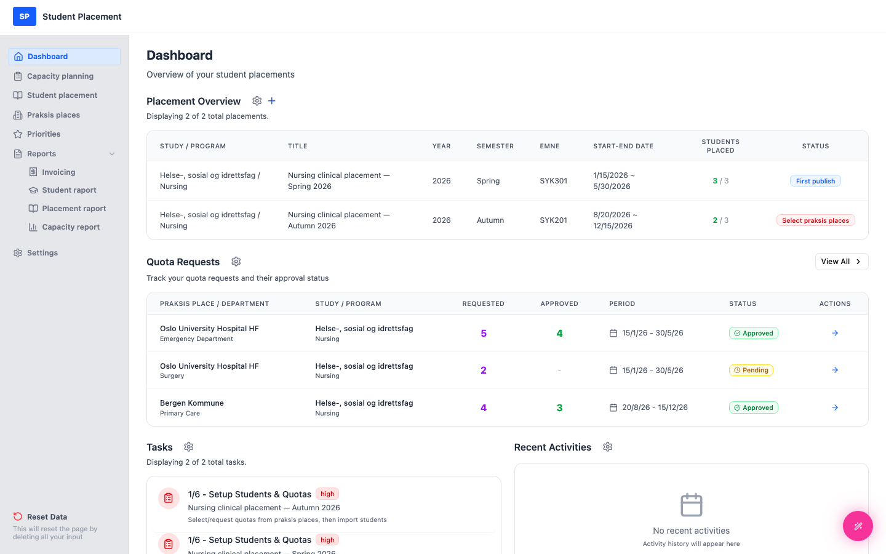
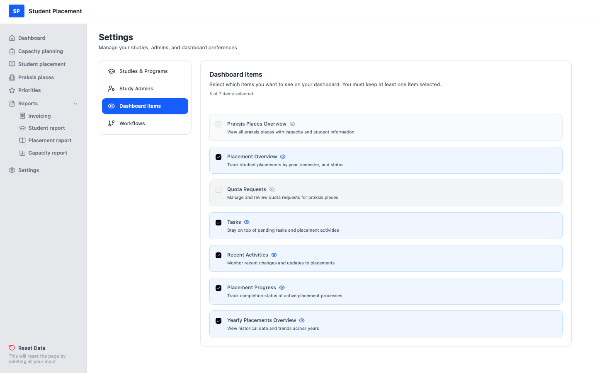
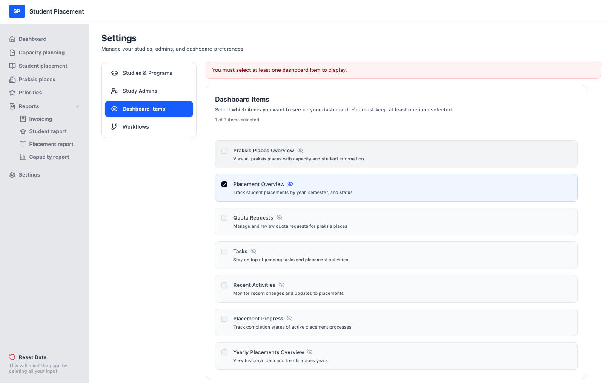

# Testscenario 03 — Inställningar - Dashboardelement

!!! info "Scenarioöversikt"

    - **Sida:** Settings → Dashboard Items
    - **Roll:** Placeringskoordinator (PK)
    - **Mål:** Välj vilka widgetar som ska visas på Dashboard och bekräfta att Dashboard uppdateras.

## Vad den här sidan är

**Dashboard Items** (under Settings) styr vilka widgetar som visas på din Dashboard
 (Placement Overview, Quota Requests, Tasks, Recent Activities m.fl.). Att växla ett element träder i kraft
 **omedelbart** — det finns ingen separat sparning. Minst ett element måste förbli valt.

---

## Steg

### 1. Börja på Dashboard

Notera vilka widgetar som visas just nu — däribland widgeten **Quota Requests**.

<figure markdown="span">
  
  <figcaption>Dashboard före — widgeten Quota Requests är synlig</figcaption>
</figure>

### 2. Öppna Settings → Dashboard Items

Klicka på **Settings** i sidofältet och sedan på **Dashboard Items**. Varje widget är ett kort med en
 kryssruta och en ögonikon; rubriken visar hur många av elementen som är valda.

<figure markdown="span">
  
  <figcaption>Dashboard Items — aktuellt urval</figcaption>
</figure>

### 3. Stäng av ett element

Klicka på kryssrutan för **Quota Requests** för att avmarkera den. Kortet blir grått, ikonen ändras till
 **dold** (överstruket öga) och antalet minskar (t.ex. *5 of 7 items selected*). Ändringen sparas direkt.

<figure markdown="span">
  
  <figcaption>Quota Requests avmarkerad — nu dold</figcaption>
</figure>

### 4. Bekräfta på Dashboard

Gå tillbaka till **Dashboard** — widgeten **Quota Requests** visas inte längre.

<figure markdown="span">
  
  <figcaption>Dashboard efter — widgeten Quota Requests är borta</figcaption>
</figure>

---

## Validering — minst ett element

Du kan inte dölja alla widgetar. Om endast ett element är valt blockeras försök att avmarkera det
 och ett rött meddelande visas: *"You must select at least one dashboard item to display."*

<figure markdown="span">
  
  <figcaption>Att avmarkera det sista elementet blockeras</figcaption>
</figure>

---

