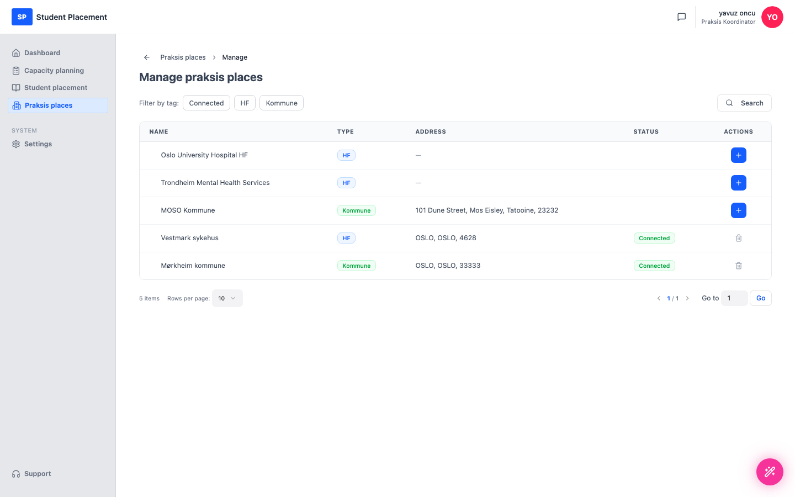
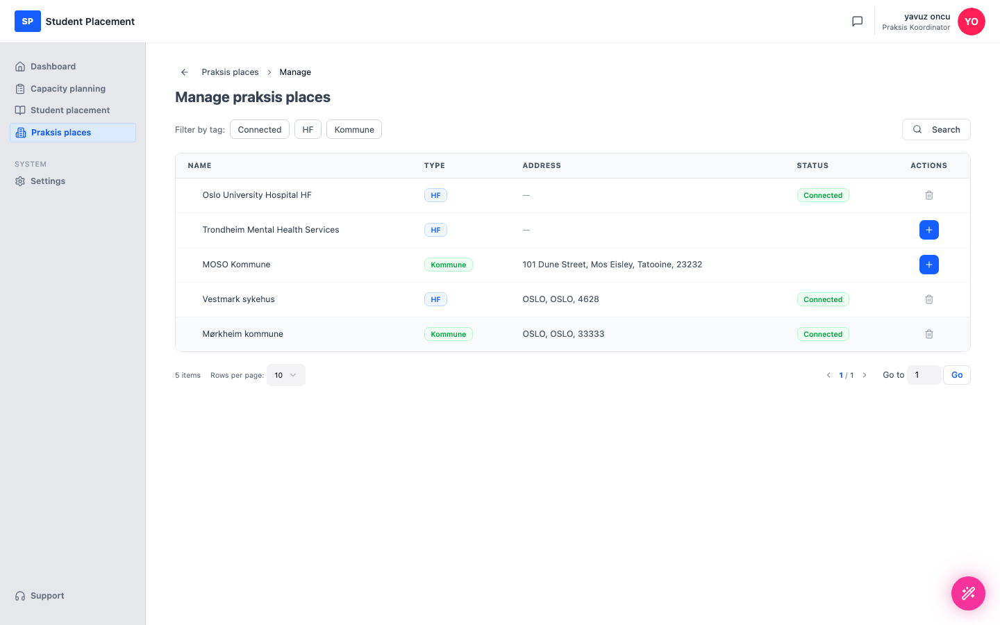

# Testscenario 04 — Anslut en praktikplats till UH

!!! info "Scenarioöversikt"

    - **Miljö:** Live — sp.mosoinpraxis.com/praksis-places
    - **Roll:** Praksis Koordinator
    - **Mål:** Anslut en tillgänglig praktikplats till din organisation.
    - **Förutsättning:** Inloggad (lösenordsfri e-postinloggning). Några praktikplatser i katalogen är ännu inte anslutna till din organisation.

## Vad den här sidan är

Sidan **Praksis places** listar de platser som är anslutna till din organisation. **Manage praksis places**
 öppnar hela katalogen, där du kan **ansluta** (lägga till) en plats till din organisation eller ta bort en.

---

## Steg

### 1. Öppna Praksis places

Klicka på **Praksis places** i sidofältet efter att du loggat in.

<figure markdown="span">
  
  <figcaption>Praksis places — för närvarande anslutna platser</figcaption>
</figure>

### 2. Öppna Manage praksis places

Klicka på **Manage praksis places** (uppe till höger) för att öppna katalogen. Anslutna platser visar en
 Connected-etikett; platser du kan lägga till visar ett blått **+** i kolumnen Actions.

<figure markdown="span">
  
  <figcaption>Manage praksis places — hela katalogen med åtgärder för att ansluta/ta bort</figcaption>
</figure>

### 3. Lägg till en praktikplats (första +)

Klicka på det första **+** i kolumnen Actions (här på **Oslo University Hospital HF**). En bekräftelsedialog
 visas: *"Oslo University Hospital HF will be added to your praksis places."*

<figure markdown="span">
  
  <figcaption>Anslutningsdialog — bekräfta att platsen läggs till</figcaption>
</figure>

### 4. Klicka på Connect

Klicka på **Connect** i dialogen för att bekräfta.

---

## Slutresultat

Praktikplatsen läggs till i din organisation — dess rad visar nu Connected-etiketten
 och **+** har ersatts av en borttagningsåtgärd (papperskorg).

<figure markdown="span">
  
  <figcaption>Slutläge — Oslo University Hospital HF är nu Connected</figcaption>
</figure>

## Anteckningar för testare

-   Använd chippen **Filter by tag** (Connected / HF / Kommune) eller **Search** för att hitta en plats.
-   För att ångra använder du **papperskorgsikonen** på en ansluten rad för att koppla bort platsen.
-   Inloggningen är lösenordsfri: begär en kod via e-post och ange den 6‑siffriga koden.

---

