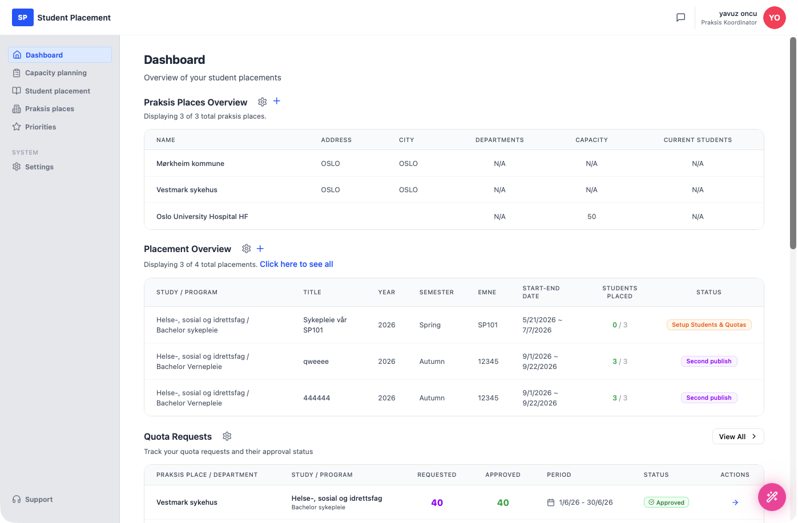
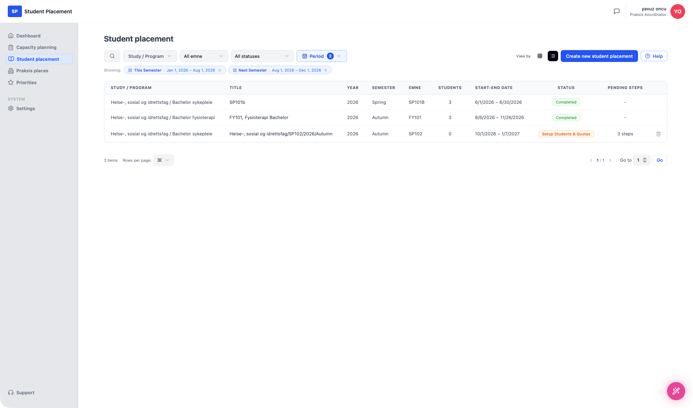
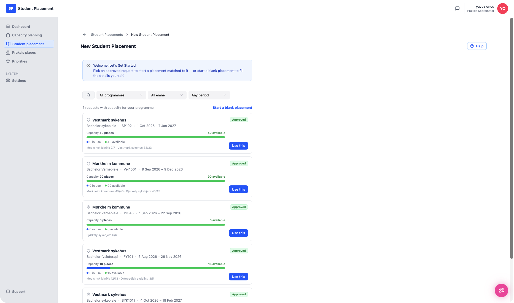
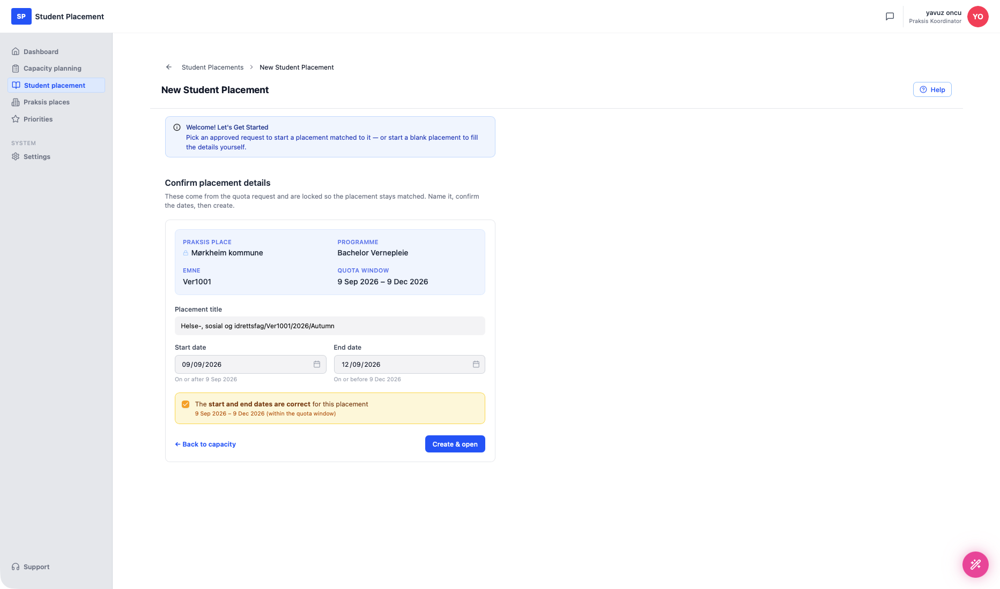
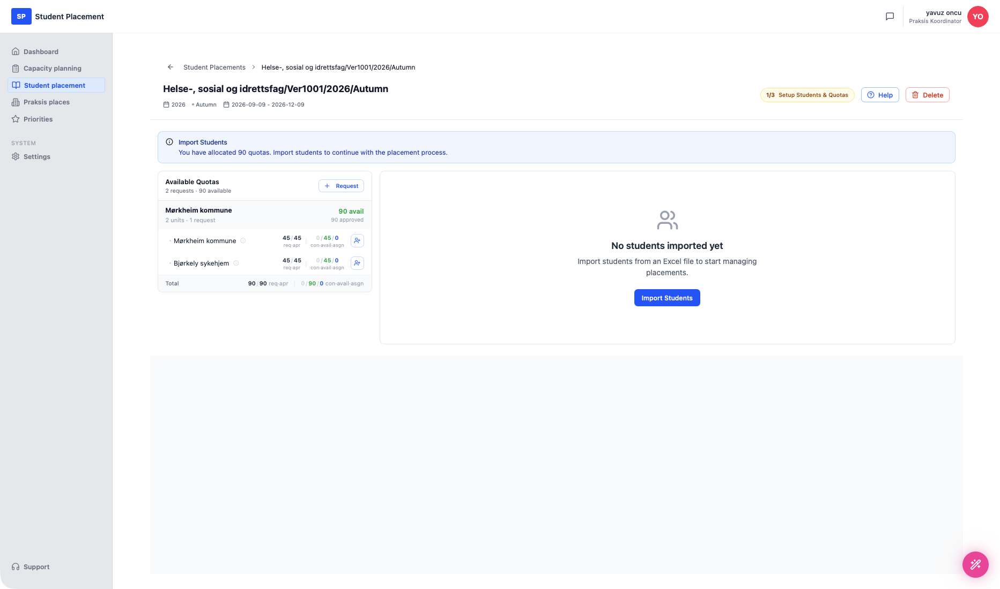

# Testscenario 09 — Studentplacering - Skapa

!!! info "Scenarioöversikt"

    - **Sida:** Student placement → New Student Placement
    - **Roll:** Placeringskoordinator (PK)
    - **Mål:** Skapa en studentplacering från en **godkänd kvotförfrågan**, så att placeringen är kopplad till förfrågan från början.
    - **Förutsättning:** Minst en godkänd kvotförfrågan med ledig kapacitet finns (skapad via Capacity planning). Placeringsformuläret fylls inte längre i manuellt — detaljerna kommer från förfrågan du väljer.

## Vad den här sidan är

**Student placement** listar alla placeringar för dina program. Överst finns filter (**Study / Program**, **emne**, **status** och en **Period**-väljare — de aktiva perioderna visas som borttagbara chips, t.ex. *This Semester · Jan 1, 2026 – Aug 1, 2026*). **View by**-reglaget växlar mellan två vyer:

- **Tabellvy** — en rad per placering med Study/Program, Title, Year, Semester, Emne, antal Students, Start–End date, Status och Pending steps, plus paginering.
- **Kalendervy** — en tidslinje över månader (t.ex. *June 2026 – December 2026*, "Showing 7 months") där varje placering ritas som en horisontell stapel över sina start–slutdatum, märkt med datumintervall och antal studenter. Pilarna flyttar det synliga fönstret och **Reset to Default** återställer det.

---

## Steg

### 1. Börja på Dashboard

<figure markdown="span">
  
  <figcaption>Utgångspunkt — Dashboard</figcaption>
</figure>

### 2. Öppna Student placement

Klicka på **Student placement** i sidofältet. Listan öppnas i den vy du använde senast — här **tabellvyn**.

<figure markdown="span">
  
  <figcaption>Student placement — tabellvy med filter och period-chips</figcaption>
</figure>

Växlar du **View by** till kalendern visas samma placeringar som staplar på en månadstidslinje:

<figure markdown="span">
  
  <figcaption>Student placement — kalendervy (placeringar ritade över sina datumintervall)</figcaption>
</figure>

### 3. Klicka på "Create new student placement"

Sidan **New Student Placement** öppnas med meddelandet *"Welcome! Let's Get Started — Pick an approved request to start a placement matched to it — or start a blank placement to fill the details yourself."*

Den listar de godkända kvotförfrågningarna med kapacitet för ditt program (här *"5 requests with capacity for your programme"*), filtrerbara på **programme**, **emne** och **period**. Varje kort visar praktikplatsen, programme · emne · period, en **Approved**-etikett, en kapacitetsstapel (platser i bruk vs. lediga), fördelningen per enhet och en **Use this**-knapp. Du kan också välja **Start a blank placement** eller **Request quota** om inget passar.

<figure markdown="span">
  
  <figcaption>New Student Placement — välj en godkänd kvotförfrågan</figcaption>
</figure>

### 4. Välj en kvotförfrågan och klicka på "Use this"

Välj den förfrågan du vill basera placeringen på — här **Mørkheim kommune · Bachelor Vernepleie · Ver1001 · 9 Sep 2026 – 9 Dec 2026** (90 lediga platser) — och klicka på **Use this**.

### 5. Bekräfta placeringsdetaljerna och skapa

Steget **Confirm placement details** visas: *"These come from the quota request and are locked so the placement stays matched. Name it, confirm the dates, then create."*

- **Praksis place**, **Programme**, **Emne** och **Quota window** visas skrivskyddade.
- **Placement title** är förifylld (här `Helse-, sosial og idrettsfag/Ver1001/2026/Autumn`) och kan redigeras.
- **Start date** och **End date** är förifyllda med kvotfönstret och måste hålla sig inom det (*"On or after 9 Sep 2026"* / *"On or before 9 Dec 2026"*).

Bocka i **"The start and end dates are correct for this placement"** — den bekräftar *9 Sep 2026 – 9 Dec 2026 (within the quota window)* — och klicka på **Create & open**.

<figure markdown="span">
  
  <figcaption>Confirm placement details — låsta förfrågningsdata, förifyllda datum, bekräftelseruta</figcaption>
</figure>

---

## Slutresultat

Placeringen skapas och öppnas på sin detaljsida: **Helse-, sosial og idrettsfag/Ver1001/2026/Autumn** (2026 · Autumn · 2026-09-09 – 2026-12-09) med status **1/3 Setup Students & Quotas**. Eftersom den skapades från förfrågan visar panelen **Available Quotas** till vänster redan den kopplade förfrågan — **Mørkheim kommune** med sina enheter (Mørkheim kommune 45/45, Bjørkely sykehjem 45/45, totalt 90 lediga). Höger kolumn uppmanar dig att **Import Students**.

Scenariot slutar här — import av studenter täcks i nästa scenario.

<figure markdown="span">
  
  <figcaption>Efter Create & open — kopplade kvoter till vänster, Import Students-uppmaning till höger</figcaption>
</figure>

---

