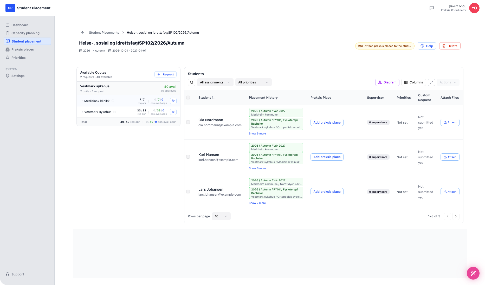
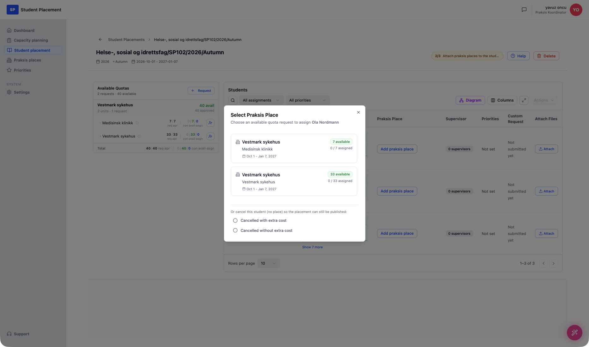

# Testscenario 10 — Studentplacering - Fördela studenter

!!! info "Scenarioöversikt"

    - **Sida:** Student placement → *(en placering)*
    - **Roll:** Placeringskoordinator (PK)
    - **Mål:** Fördela de importerade studenterna över de tillgängliga kvoterna (praktikplatserna), så att varje student har en plats för sin praktik.
    - **Förutsättning:** En placering finns med importerade studenter och minst en godkänd kvot. Denna genomgång använder **Helse-, sosial og idrettsfag/SP102/2026/Autumn** med **3 importerade studenter**.

## Om import av studenter

Studenter läggs till en placering före det här steget. De kan **importeras från en Excel-fil** eller **hämtas automatiskt från det nationella studentregistret** — **FS** i Norge eller **Ladok** i Sverige. För den här demonstrationen importerades **3 mockstudenter** (Ola Nordmann, Kari Hansen, Lars Johansen).

## Förstå den här sidan

Placeringens detaljsida har två länkade paneler:

- **Available Quotas** (vänster) — **platserna studenter kan tilldelas**. Varje godkänd förfrågan grupperas per praktikplats och delas upp per enhet, med värdena **req · apr** (begärt / godkänt) och **con · avail · asgn** (bekräftat / tillgängligt / tilldelat). **+ (Assign students)**-ikonen på en enhet öppnar en snabbtilldelningspanel. **Total**-raden summerar hela kvoten.
- **Students** (höger) — **personerna som ska placeras** för sin praktik. Varje rad visar studenten, placeringshistoriken, den tilldelade **Praksis Place** (eller en **Add praksis place**-knapp när ingen är angiven), handledare, prioriteringar, anpassad förfrågan och filbilagor. Ovanför tabellen finns en sökruta, filtren **All assignments** / **All priorities** och knapparna **Diagram**, **Columns**, expandera och **Actions**.

En förloppsetikett högst upp (t.ex. **2/3 Attach praksis places to the students**) visar hur långt placeringen har kommit i arbetsflödet. Allteftersom studenter tilldelas uppdateras kvotvärdena till vänster i realtid.

Det finns **tre sätt att tilldela en student en plats**, alla visade nedan.

<figure markdown="span">
  
  <figcaption>Placeringssidan — Available Quotas (vänster) och de 3 importerade studenterna (höger)</figcaption>
</figure>

---

## Steg

### 1. Öppna placeringen

Klicka på **Student placement** i sidofältet och välj **Helse-, sosial og idrettsfag/SP102/2026/Autumn**.

### 2. Tilldela första studenten — "Add praksis place" (studenttabellen)

I **Students**-tabellen klickar du på **Add praksis place** på **Ola Nordmann**s rad. En **Select Praksis Place**-dialog listar de tillgängliga kvotförfrågningarna (med tillgänglighet och antal tilldelade). Den erbjuder också att *avboka* studenten — med eller utan extra kostnad — så att placeringen fortfarande kan publiceras om ingen plats passar.

Välj en plats — här **Vestmark sykehus · Medisinsk klinikk** — för att tilldela Ola.

<figure markdown="span">
  
  <figcaption>"Add praksis place" — välj en kvotförfrågan för studenten</figcaption>
</figure>

Studentens rad visar nu den tilldelade platsen med **Change place** / **Detach**, och Available Quotas-värdena uppdateras (enheten går till *1 tilldelad*).

<figure markdown="span">
  
  <figcaption>Ola tilldelad Medisinsk klinikk — kvotvärdena uppdaterade till vänster</figcaption>
</figure>

### 3. Tilldela andra studenten — "+"-ikonen i Available Quotas

I panelen **Available Quotas** klickar du på **+ (Assign students)**-ikonen på en enhet — här **Vestmark sykehus**. En **Quick Assign Students**-panel öppnas med de otilldelade studenterna. Bocka i **Kari Hansen** och klicka på **Assign 1 Student**.

<figure markdown="span">
  
  <figcaption>Quick Assign — välj otilldelade studenter för en enhet och tilldela i bulk</figcaption>
</figure>

### 4. Tilldela sista studenten — Diagram-vyn

Klicka på **Diagram** (ovanför studenttabellen) för att öppna **Placement Network Diagram**. Den visar praktikplatser till vänster och studenter till höger; befintliga tilldelningar ritas som förbindelselinjer (var och en med ett **×** för att ta bort den), och otilldelade studenter visas som streckade kort. Du tilldelar en student genom att **dra en förbindelse från en plats till studenten**.

Här är **Lars Johansen** den återstående otilldelade studenten — att koppla honom till **Vestmark sykehus** slutför fördelningen.

<figure markdown="span">
  
  <figcaption>Diagram-vy — dra från en plats till en student för att tilldela (Lars fortfarande otilldelad)</figcaption>
</figure>

---

## Slutresultat

När alla tre studenterna är tilldelade visar förloppsetiketten **3/3**, och ett grönt banner visas: **"All students assigned — ready to publish. Publishing will lock all assignments and notify the praksis places."** En **Publish assignments**-knapp blir tillgänglig. Varje studentrad visar sin tilldelade plats, och panelen Available Quotas återspeglar **3 tilldelade**.

Scenariot slutar här — studenterna är helt fördelade och placeringen är redo att publiceras.

<figure markdown="span">
  
  <figcaption>Alla 3 studenterna placerade — redo att publicera</figcaption>
</figure>

---

