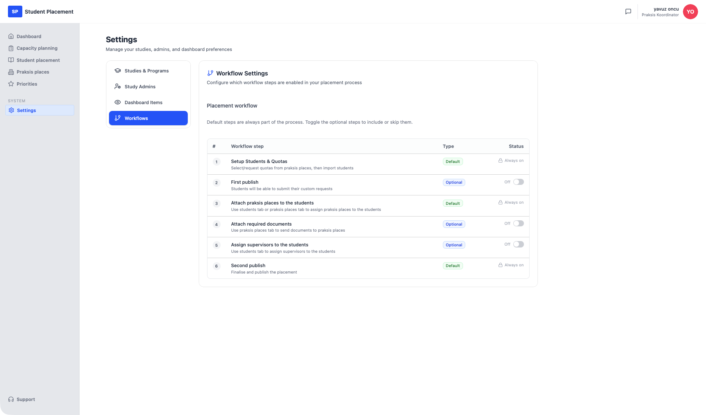

# Studentplacering - Samla in studentönskemål

!!! info "Scenarioöversikt"

    - **Sida:** Settings → Workflows, sedan Student placement → *(en placering)*
    - **Roll:** Placeringskoordinator (PK)
    - **Mål:** Aktivera det valfria arbetsflödessteget **First publish** och publicera sedan en placering för första gången, så att studenterna får ett e-postmeddelande och kan skicka in sina egna **custom requests** (önskad praktikplats + ett meddelande).
    - **Förutsättning:** En placering med studenter redan importerade. Den här genomgången använder **Helse-, sosial og idrettsfag/SP102/2026/Autumn**.

## Vad det här valfria arbetsflödet är

Placeringsprocessen går igenom en fast uppsättning arbetsflödessteg. Vissa är **Default** (alltid på) och vissa är **Optional** — du slår på dem efter behov. **First publish** är ett valfritt steg som ligger tidigt i processen, *innan* praktikplatser kopplas till studenter.

När det är aktiverat och utlöst skickar First publish varje importerad student en **e-postinbjudan** att logga in och **skicka in sina önskemål**: vilken praktikplats de vill ha och eventuella särskilda förfrågningar eller hänsyn. Deras svar kommer tillbaka i kolumnen **Custom Request** i studenttabellen, så att koordinatorn kan ta hänsyn till dem vid tilldelning av platser. Det är mekanismen för att *samla in studentönskemål* före fördelningen.

---

## Steg

### 1. Aktivera "First publish" i Settings → Workflows

Öppna **Settings** i sidofältet och välj fliken **Workflows**. Tabellen **Placement workflow** listar varje steg med **Type** (Default / Optional) och **Status**. Standardsteg visar ett lås och *Always on*; valfria steg har en växlare.

<figure markdown="span">
  
  <figcaption>Workflow Settings — "First publish" (steg 2) är Optional och Off</figcaption>
</figure>

Slå på **First publish**. En bekräftelse *"Workflow setting saved"* visas och statusen växlar till **On**. Detta lägger till det valfria steget i arbetsflödet för alla placeringar.

<figure markdown="span">
  
  <figcaption>First publish är nu On — steget är en del av placeringsarbetsflödet</figcaption>
</figure>

### 2. Öppna placeringen

Skapa en ny placering och importera studenter. Eftersom First publish nu är aktiverat har placeringens arbetsflöde fått ett steg (förloppsetiketten visar **2/4**), och ett grönt banner visas: **"Ready for first publish — Publish placement to the students to collect custom requests"** med en **First publish**-knapp.

Observera att kolumnen **Custom Request** visar *"Not submitted yet"* för varje student — inget har samlats in ännu.

<figure markdown="span">
  
  <figcaption>Placeringen är redo för first publish</figcaption>
</figure>

### 3. First publish — konfigurera inbjudan

Klicka på **First publish**. Dialogen **First Publish - Student Request Collection** öppnas:

- **Deadline for Student Submissions** — datumet fram till vilket studenterna kan skicka in sina önskemål.
- **Message to Students** — en redigerbar e-posttext (förifylld med ett standardmeddelande).
- **What happens next?** — en sammanfattning som bekräftar att alla studenter får en e-postlänk, kan välja en önskad praktikplats och lägga till ett eget meddelande, och att svaren visas i kolumnen **Custom Requests**.

Ange en deadline (här `09/15/2026`), justera meddelandet vid behov och klicka sedan på **Publish & Send Invitations**.

<figure markdown="span">
  
  <figcaption>First Publish — ange deadline och meddelande, och skicka inbjudningarna</figcaption>
</figure>

---

## Slutresultat

Placeringen publiceras till studenterna. Förloppsetiketten går vidare till **3/4 — Attach praksis places to the students**, och banneret "Ready for first publish" är borta. Varje importerad student får nu ett e-postmeddelande med en länk för att skicka in sina önskemål; tills de svarar förblir kolumnen **Custom Request** *"Not submitted yet"*, och deras svar visas där allteftersom de kommer in.

<figure markdown="span">
  
  <figcaption>Efter first publish — inbjudningar skickade, väntar på studentinlämningar</figcaption>
</figure>

---

